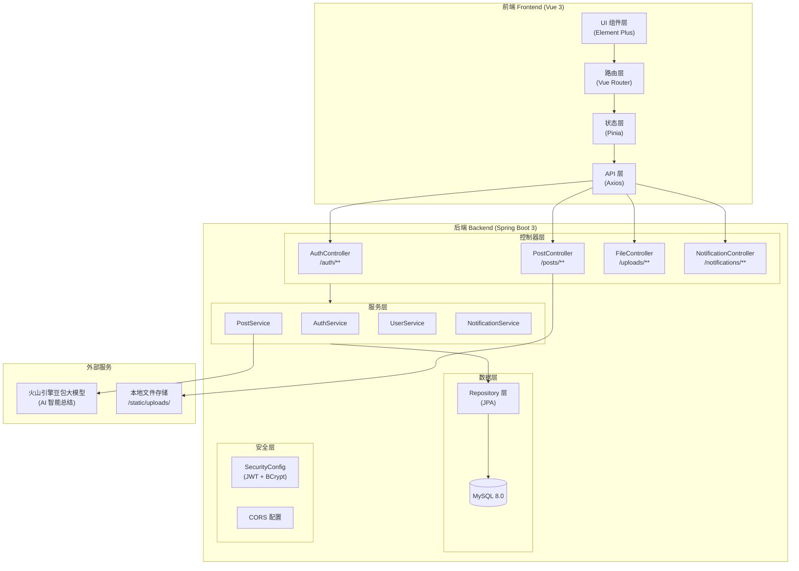
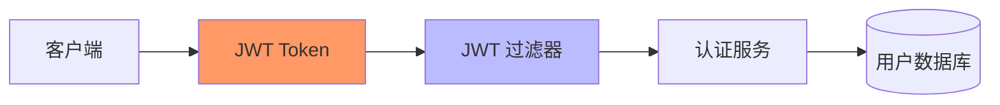
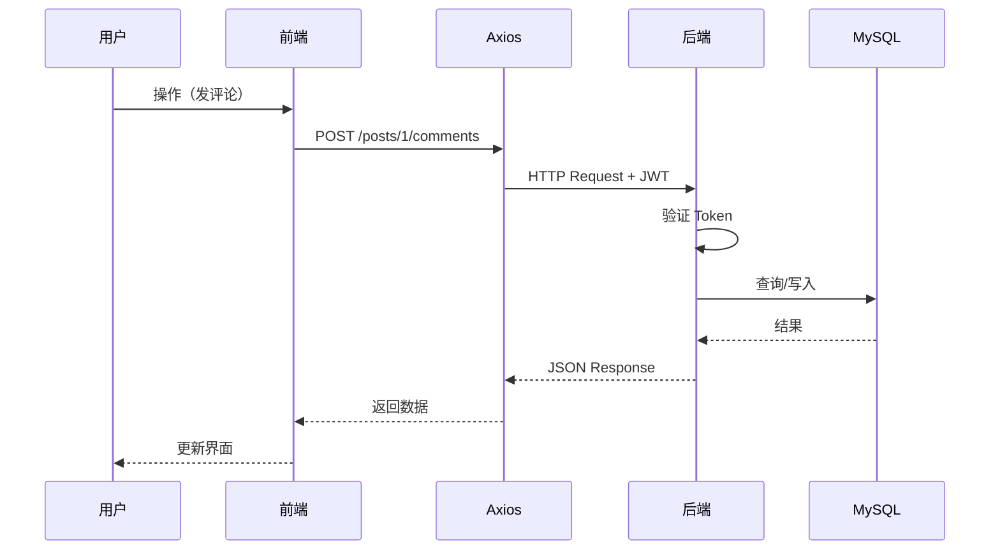

# Essencity 架构设计文档

> 最后更新：2026-03-24

## 1. 系统架构图



## 2. 技术栈详情

### 前端
| 类别 | 技术 | 说明 |
|------|------|------|
| 框架 | Vue 3 (Composition API) | 渐进式前端框架 |
| 构建工具 | Vite | 快速开发服务器 |
| UI 库 | Element Plus | Vue 3 组件库 |
| 状态管理 | Pinia | Vue 3 推荐状态管理 |
| 路由 | Vue Router | SPA 路由管理 |
| HTTP 客户端 | Axios | API 请求封装 |
| 样式 | CSS | 全局样式 |

### 后端
| 类别 | 技术 | 说明 |
|------|------|------|
| 框架 | Spring Boot 3 | Java 主流框架 |
| ORM | Spring Data JPA | 数据库持久化 |
| 数据库 | MySQL 8.0 | 关系型数据库 |
| 安全 | Spring Security + JWT | 身份认证 |
| 密码加密 | BCrypt | 密码哈希 |
| API 文档 | Swagger | API 调试界面 |

### 外部服务
| 服务 | 用途 |
|------|------|
| 火山引擎豆包大模型 | AI 笔记总结（待接入） |

## 3. 前端目录结构

```
frontend/src/
├── components/              # Vue 组件
│   ├── TheHeader.vue        # 顶部导航
│   ├── TheSidebar.vue       # 侧边栏
│   ├── MasonryGrid.vue      # 瀑布流布局
│   ├── CategoryTabs.vue     # 分类标签
│   ├── PostCard.vue         # 帖子卡片
│   ├── PostDetailModal.vue  # 帖子详情弹窗
│   ├── CreationPage.vue     # 创作页面
│   ├── ProfilePage.vue      # 个人主页
│   ├── NotificationPage.vue # 通知页面
│   ├── AuthModal.vue        # 登录/注册弹窗
│   └── CompleteProfileModal.vue  # 完善资料弹窗
├── config/                  # 配置文件
├── App.vue                  # 根组件
├── main.js                  # 入口文件
└── style.css                # 全局样式
```

## 4. 后端目录结构

```
backend/src/main/java/com/xiaohongshu/
├── config/
│   ├── SecurityConfig.java  # Spring Security + JWT 配置
│   └── WebConfig.java       # CORS + 资源处理
├── controller/
│   ├── AuthController.java       # 认证（注册/登录）
│   ├── PostController.java       # 帖子 CRUD + 点赞/收藏/评论
│   ├── FileController.java       # 文件上传
│   └── NotificationController.java # 通知
├── service/
│   ├── AuthService.java
│   ├── PostService.java
│   ├── UserService.java
│   └── NotificationService.java
├── repository/
│   ├── UserRepository.java
│   ├── PostRepository.java
│   ├── LikeRepository.java
│   ├── CollectionRepository.java
│   ├── CommentRepository.java
│   └── FollowRepository.java
├── entity/
│   ├── User.java
│   ├── Post.java
│   ├── Like.java
│   ├── Collection.java
│   ├── Comment.java
│   └── Follow.java
├── dto/
│   └── NotificationDTO.java
├── XiaohongshuApplication.java   # 启动类
├── DataInitializer.java          # 数据初始化
└── DbConnectionTest.java         # 数据库连接测试
```

## 5. API 架构

### 5.1 认证模块 `/auth/**`
```
POST /auth/register     # 用户注册
POST /auth/login        # 用户登录
```

### 5.2 帖子模块 `/posts/**`
```
GET    /posts                    # 获取帖子列表（支持搜索/标签过滤）
GET    /posts/{id}               # 获取帖子详情
POST   /posts                    # 创建帖子
DELETE /posts/{id}               # 删除帖子
POST   /posts/upload             # 上传图片/视频

# 互动
GET    /posts/{id}/like/status   # 点赞状态
POST   /posts/{id}/like          # 点赞
POST   /posts/{id}/unlike        # 取消点赞
GET    /posts/{id}/collect/status # 收藏状态
POST   /posts/{id}/collect       # 收藏
POST   /posts/{id}/uncollect     # 取消收藏

# 评论
GET    /posts/{id}/comments      # 获取评论
POST   /posts/{id}/comments      # 添加评论
DELETE /posts/comments/{id}      # 删除评论

# 用户数据
GET    /posts/user/{id}/stats    # 用户统计（帖子/获赞/收藏数）
GET    /posts/user/{id}/collections # 用户收藏列表
GET    /posts/user/{id}/likes    # 用户点赞列表
```

### 5.3 用户模块
```
GET    /users/{id}               # 获取用户信息
PUT    /users/{id}               # 更新用户信息
GET    /users/{id}/followers      # 粉丝列表
GET    /users/{id}/following      # 关注列表
POST   /users/{id}/follow         # 关注
POST   /users/{id}/unfollow       # 取关
```

### 5.4 通知模块
```
GET    /notifications            # 获取通知列表
```

### 5.5 文件模块
```
GET    /uploads/**                # 访问上传的文件
```

## 6. 安全架构



### 安全措施
| 措施 | 说明 |
|------|------|
| JWT | 无状态认证，Token 包含用户信息 |
| BCrypt | 密码加密存储，不可逆 |
| CORS | 限制允许的请求来源 |
| CSRF | 已禁用（前后端分离模式） |
| 文件上传 | 校验文件大小和类型 |

## 7. 数据流



## 8. 部署架构

```
┌─────────────────────────────────────────────────────┐
│                     用户浏览器                        │
└─────────────────────┬───────────────────────────────┘
                      │ HTTP
                      ▼
┌─────────────────────────────────────────────────────┐
│                   Nginx (可选)                       │
│              反向代理 + 静态资源缓存                    │
└─────────────────────┬───────────────────────────────┘
                      │
        ┌─────────────┴─────────────┐
        ▼                           ▼
┌───────────────┐         ┌───────────────┐
│  前端 Vite    │         │  后端 Spring  │
│  :5173 (dev)  │         │   Boot :8080  │
│  静态资源      │         │   API 服务    │
└───────────────┘         └───────┬───────┘
                                   │
                                   ▼
                          ┌───────────────┐
                          │   MySQL :3306 │
                          │   xiaohongshu │
                          └───────────────┘
```

## 9. 未来扩展点

| 功能 | 状态 | 说明 |
|------|------|------|
| AI 笔记总结 | 待开发 | 火山引擎豆包大模型 |
| 语音搜索 | 待开发 | Web Speech API |
| 话题标签 | 待开发 | 发布页 + 详情页 |
| 多图笔记 | 待开发 | 最多 9 张 |
