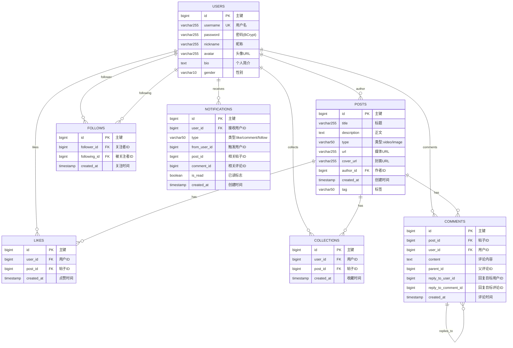
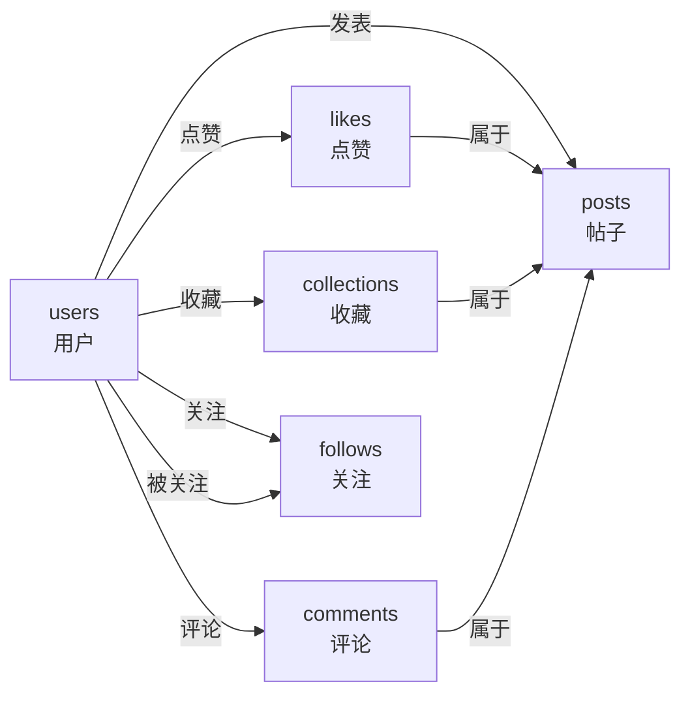

# Essencity 数据库设计文档

> 最后更新：2026-03-24

## 1. ER 图



## 2. 表结构详情

### 2.1 users（用户表）

| 字段 | 类型 | 约束 | 说明 |
|------|------|------|------|
| id | BIGINT | PK, AUTO_INCREMENT | 主键 |
| username | VARCHAR(255) | NOT NULL, UNIQUE | 用户名（登录账号） |
| password | VARCHAR(255) | NOT NULL | 密码（BCrypt 加密） |
| nickname | VARCHAR(255) | - | 昵称 |
| avatar | VARCHAR(255) | - | 头像 URL |
| bio | TEXT | - | 个人简介 |
| gender | VARCHAR(10) | - | 性别 |

```sql
CREATE TABLE users (
    id BIGINT AUTO_INCREMENT PRIMARY KEY,
    username VARCHAR(255) NOT NULL UNIQUE,
    password VARCHAR(255) NOT NULL,
    nickname VARCHAR(255),
    avatar VARCHAR(255),
    bio TEXT,
    gender VARCHAR(10)
);
```

### 2.2 posts（帖子表）

| 字段 | 类型 | 约束 | 说明 |
|------|------|------|------|
| id | BIGINT | PK, AUTO_INCREMENT | 主键 |
| title | VARCHAR(255) | NOT NULL | 标题 |
| description | TEXT | - | 正文/描述 |
| type | VARCHAR(50) | NOT NULL | 类型：video / image |
| url | VARCHAR(255) | NOT NULL | 媒体资源 URL |
| cover_url | VARCHAR(255) | - | 视频封面 URL |
| author_id | BIGINT | FK → users.id, NOT NULL | 作者 ID |
| created_at | TIMESTAMP | DEFAULT CURRENT_TIMESTAMP | 创建时间 |
| tag | VARCHAR(50) | - | 分类标签 |

```sql
CREATE TABLE posts (
    id BIGINT AUTO_INCREMENT PRIMARY KEY,
    title VARCHAR(255) NOT NULL,
    description TEXT,
    type VARCHAR(50) NOT NULL,
    url VARCHAR(255) NOT NULL,
    cover_url VARCHAR(255),
    author_id BIGINT NOT NULL,
    created_at TIMESTAMP DEFAULT CURRENT_TIMESTAMP,
    tag VARCHAR(50),
    FOREIGN KEY (author_id) REFERENCES users(id)
);
```

### 2.3 likes（点赞表）

| 字段 | 类型 | 约束 | 说明 |
|------|------|------|------|
| id | BIGINT | PK, AUTO_INCREMENT | 主键 |
| user_id | BIGINT | FK → users.id, NOT NULL | 点赞用户 ID |
| post_id | BIGINT | FK → posts.id, NOT NULL | 被赞帖子 ID |
| created_at | TIMESTAMP | DEFAULT CURRENT_TIMESTAMP | 点赞时间 |

**唯一约束**: `(user_id, post_id)` — 同一用户不能重复点赞同一帖子

```sql
CREATE TABLE likes (
    id BIGINT AUTO_INCREMENT PRIMARY KEY,
    user_id BIGINT NOT NULL,
    post_id BIGINT NOT NULL,
    UNIQUE KEY unique_user_post (user_id, post_id),
    FOREIGN KEY (user_id) REFERENCES users(id),
    FOREIGN KEY (post_id) REFERENCES posts(id)
);
```

### 2.4 collections（收藏表）

| 字段 | 类型 | 约束 | 说明 |
|------|------|------|------|
| id | BIGINT | PK, AUTO_INCREMENT | 主键 |
| user_id | BIGINT | FK → users.id, NOT NULL | 收藏用户 ID |
| post_id | BIGINT | FK → posts.id, NOT NULL | 被藏帖子 ID |
| created_at | TIMESTAMP | DEFAULT CURRENT_TIMESTAMP | 收藏时间 |

**唯一约束**: `(user_id, post_id)` — 同一用户不能重复收藏同一帖子

```sql
CREATE TABLE collections (
    id BIGINT AUTO_INCREMENT PRIMARY KEY,
    user_id BIGINT NOT NULL,
    post_id BIGINT NOT NULL,
    UNIQUE KEY unique_user_post_collection (user_id, post_id),
    FOREIGN KEY (user_id) REFERENCES users(id),
    FOREIGN KEY (post_id) REFERENCES posts(id)
);
```

### 2.5 comments（评论表）

| 字段 | 类型 | 约束 | 说明 |
|------|------|------|------|
| id | BIGINT | PK, AUTO_INCREMENT | 主键 |
| post_id | BIGINT | FK → posts.id, NOT NULL | 所属帖子 ID |
| user_id | BIGINT | FK → users.id, NOT NULL | 评论用户 ID |
| content | TEXT | NOT NULL | 评论内容 |
| parent_id | BIGINT | - | 父评论 ID（支持二级楼中楼） |
| reply_to_user_id | BIGINT | FK → users.id | 回复目标用户 ID |
| reply_to_comment_id | BIGINT | - | 回复目标评论 ID |
| created_at | TIMESTAMP | DEFAULT CURRENT_TIMESTAMP | 评论时间 |

```sql
CREATE TABLE comments (
    id BIGINT AUTO_INCREMENT PRIMARY KEY,
    post_id BIGINT NOT NULL,
    user_id BIGINT NOT NULL,
    content TEXT NOT NULL,
    parent_id BIGINT,
    created_at TIMESTAMP DEFAULT CURRENT_TIMESTAMP,
    FOREIGN KEY (post_id) REFERENCES posts(id),
    FOREIGN KEY (user_id) REFERENCES users(id)
);
```

### 2.6 follows（关注表）

| 字段 | 类型 | 约束 | 说明 |
|------|------|------|------|
| id | BIGINT | PK, AUTO_INCREMENT | 主键 |
| follower_id | BIGINT | FK → users.id, NOT NULL | 关注者 ID |
| following_id | BIGINT | FK → users.id, NOT NULL | 被关注者 ID |
| created_at | TIMESTAMP | DEFAULT CURRENT_TIMESTAMP | 关注时间 |

**唯一约束**: `(follower_id, following_id)` — 同一用户不能重复关注同一用户

```sql
CREATE TABLE follows (
    id BIGINT AUTO_INCREMENT PRIMARY KEY,
    follower_id BIGINT NOT NULL,
    following_id BIGINT NOT NULL,
    created_at TIMESTAMP DEFAULT CURRENT_TIMESTAMP,
    UNIQUE KEY unique_follow (follower_id, following_id),
    FOREIGN KEY (follower_id) REFERENCES users(id),
    FOREIGN KEY (following_id) REFERENCES users(id)
);
```

### 2.7 notifications（通知表）⚠️ 待完善

> **注意**: 当前代码中有 `NotificationController` 和 `NotificationService`，但 `schema.sql` 中未定义此表。

| 字段 | 类型 | 约束 | 说明 |
|------|------|------|------|
| id | BIGINT | PK, AUTO_INCREMENT | 主键 |
| user_id | BIGINT | FK → users.id | 接收通知的用户 |
| type | VARCHAR(50) | - | 通知类型：like / comment / follow |
| from_user_id | BIGINT | FK → users.id | 触发通知的用户 |
| post_id | BIGINT | FK → posts.id | 相关帖子 |
| comment_id | BIGINT | FK → comments.id | 相关评论 |
| is_read | BOOLEAN | DEFAULT FALSE | 是否已读 |
| created_at | TIMESTAMP | DEFAULT CURRENT_TIMESTAMP | 创建时间 |

## 3. 表关系总结



## 4. 索引设计

| 表名 | 索引类型 | 字段 | 用途 |
|------|---------|------|------|
| likes | UNIQUE | (user_id, post_id) | 防止重复点赞 |
| collections | UNIQUE | (user_id, post_id) | 防止重复收藏 |
| follows | UNIQUE | (follower_id, following_id) | 防止重复关注 |
| posts | INDEX | tag | 按分类查询 |
| posts | INDEX | author_id | 按用户查询帖子 |
| comments | INDEX | post_id | 按帖子查询评论 |
| comments | INDEX | parent_id | 查询楼中楼评论 |

## 5. 业务规则

### 5.1 唯一性约束
- 用户名全局唯一
- 同一用户对同一帖子只能点赞一次
- 同一用户对同一帖子只能收藏一次
- 同一用户对同一用户只能关注一次

### 5.2 级联关系
| 操作 | 级联效果 |
|------|---------|
| 删除用户 | 级联删除其帖子（需手动配置 CascadeType） |
| 删除帖子 | 级联删除其点赞、收藏、评论记录（需手动配置） |
| 删除评论 | 无级联（评论的楼中楼保留） |

### 5.3 标签分类
帖子 `tag` 字段支持以下分类：
- 美食、穿搭、彩妆、影视、职场、情感、家居、游戏、旅行、健身

## 6. 待完善项

| 项目 | 优先级 | 说明 |
|------|--------|------|
| notifications 表 | 高 | schema.sql 中缺失，需补充建表语句 |
| AI 总结字段 | 中 | posts 表需增加 `ai_summary` 字段（待 AI 功能开发） |
| 级联删除配置 | 中 | JPA 实体需配置 `@OnDelete` 规则 |
