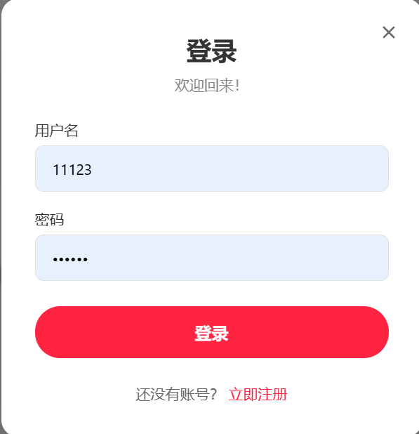
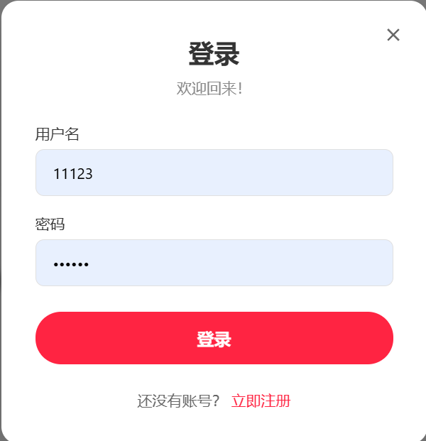
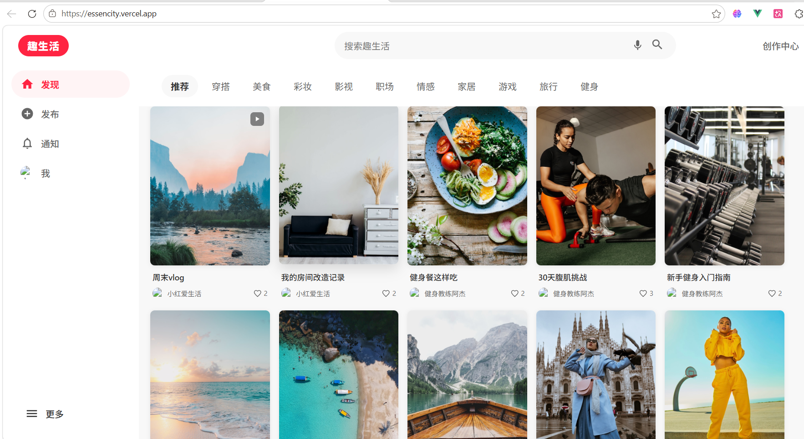
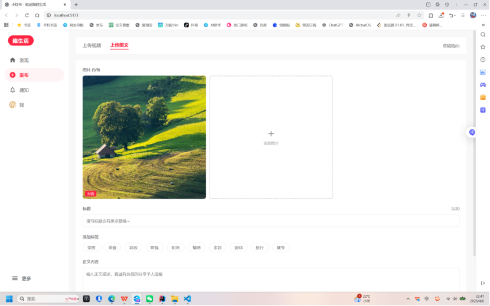
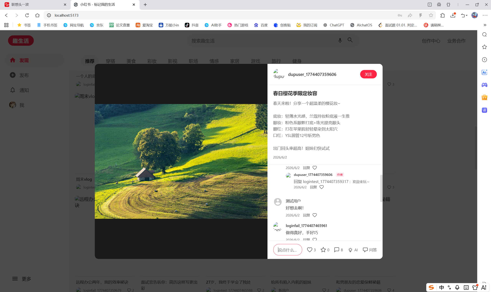
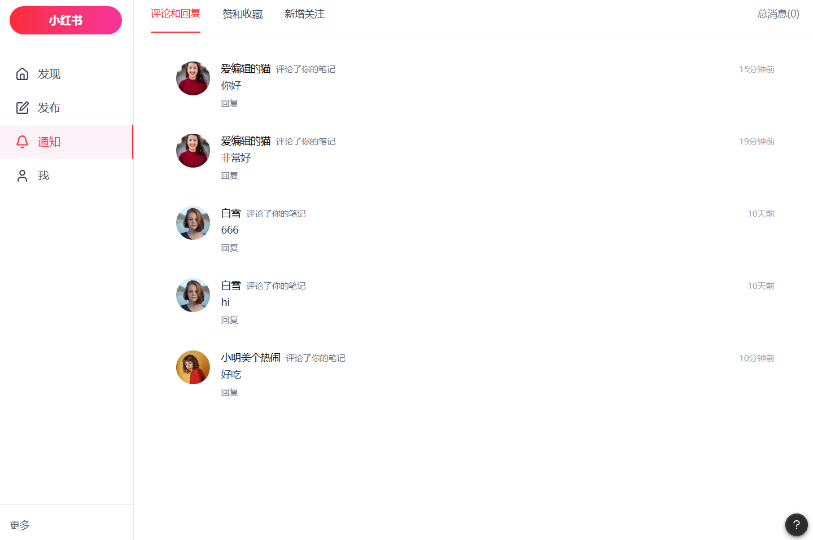
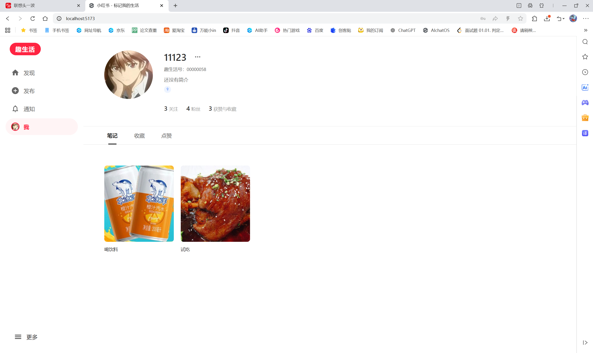
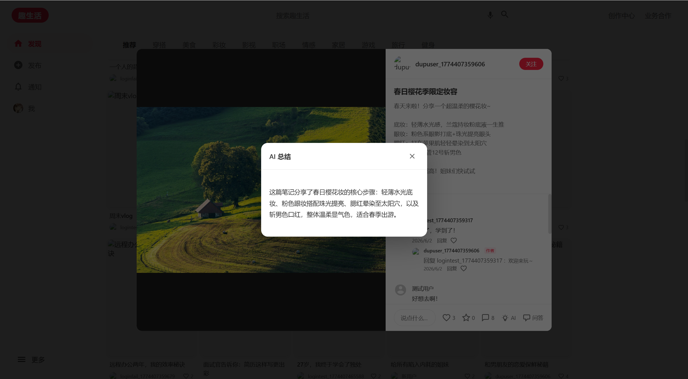

---

# 一、项目介绍 [林忠阳、林烨澄、陈熠恒]

## 1.1 背景与问题陈述

在当今社交媒体的浪潮中，图文社交平台已成为人们分享日常生活、交流兴趣爱好、传播知识信息的重要载体。以小红书为代表的社交平台凭借其独特的笔记形式——结合精美图片与深度文字内容，成功打造了一个集生活分享、消费决策与内容社区为一体的生态系统，日活跃用户数突破 2 亿，月活跃用户数超过 3 亿，覆盖美妆、美食、穿搭、旅行、健身、家居等 30 余个核心品类。然而，对于在校学生和年轻开发者群体而言，市面上的大型社交平台存在以下显著痛点：

首先，**平台过度商业化导致内容失真**。当前主流社交平台充斥着大量商业推广和软文广告，用户难以区分真实分享和商业营销内容，真实用户生成内容（UGC）的比例持续下降，严重影响了用户的浏览体验和信任感。

其次，**信息过载问题日益严重**。用户每天面对海量的笔记内容，难以快速获取关键信息和核心要点。一篇数千字的长笔记中，核心信息往往分散在多个段落，用户需要花费大量时间阅读全文才能把握重点信息。这催生了对 AI 智能总结能力的强烈需求——用户期望能通过一键操作，在短短几秒内获得笔记的核心摘要。

第三，**封闭生态限制了数据可移植性**。大型平台的内容数据和用户行为数据被完全锁定在平台内部，用户无法导出自己的笔记内容，开发者也无法基于这些数据进行二次创新和应用开发。

第四，**缺乏面向学生群体的轻量级社交平台**。现有平台功能臃肿复杂，学习成本高，对开发者不友好，没有一个既具备核心社交功能、又能作为学习项目进行二次开发的轻量级开源平台。

第五，**移动端体验与桌面端体验割裂**。许多社交平台优先发展移动端 App，其 Web 端体验往往被忽视，存在加载速度慢、交互不流畅、适配不完善等问题。而我们的目标用户群体既需要在手机上随时随地浏览，也需要在电脑上进行更深度的内容创作和浏览。

第六，**语音交互在社交平台中的应用不足**。随着语音助手和智能音箱的普及，用户对语音交互的接受度越来越高。然而，现有的图文社交平台很少集成语音搜索功能，用户在需要解放双手的场景下（如做菜时查看食谱、健身时浏览教程）无法便捷地进行内容检索。

随着 AI 技术的快速发展，2024-2026 年间大语言模型（LLM）能力取得了突飞猛进的进步。以 ChatGPT、DeepSeek 等为代表的 AI 模型，在文本理解、内容摘要和自然语言生成方面展现出了惊人的能力。然而，将这些 AI 能力有机地整合到社交平台中，真正为用户创造价值——而非仅仅作为"演示功能"——仍然是一个具有挑战性的工程课题。如何在适当的场景触发 AI、如何处理 AI 调用的延迟和成本、如何将 AI 输出与用户生成内容自然融合，这些都是我们在项目设计和实现中需要认真考虑的问题。

基于以上背景，我们团队决定开发 **Essencity**——一个面向学生群体的轻量级仿小红书社交平台。该项目不仅实现了图文笔记发布、互动交流、内容搜索、AI 智能总结、语音搜索等核心功能，还将其打造为一个优秀的全栈学习项目，涵盖了前后端分离架构、RESTful API 设计、数据库建模、安全性防护、CI/CD 自动化、容器化部署等多个软件工程核心领域。项目的名称 "Essencity" 由 "Essence"（精华/本质）和 "City"（城市）合成，寓意一个充满精华内容的社交城市。

项目的核心价值主张包括以下六个方面：第一，提供纯净的内容社区体验，远离商业化干扰；第二，集成 AI 智能总结能力，帮助用户在信息爆炸时代快速获取关键信息；第三，支持多终端响应式访问，确保桌面端和移动端都能获得优秀体验；第四，提供语音搜索等创新交互方式，提升使用的便捷性；第五，对外开放源代码，为开发者社区提供一个现代化全栈项目的参考实现；第六，遵循严格的软件工程规范，覆盖从需求分析、系统设计到测试部署的完整开发流程。

## 1.2 项目目标与核心功能

本项目旨在构建一个功能完整、体验优良、技术现代的社交笔记分享平台。具体目标包括以下几点：

第一，**构建完整的用户系统**。实现用户注册、登录、个人资料管理、头像上传等基础功能，采用 JWT（JSON Web Token）+ BCrypt 确保账户安全。用户能够修改个人昵称、简介、性别等信息，并能查看其他用户的个人主页，浏览其发布的所有笔记内容。

第二，**实现图文笔记全生命周期管理**。支持图文笔记的创建、编辑、删除、浏览等完整操作。用户最多可上传 9 张图片配以文字描述，支持为笔记添加分类标签（如美食、穿搭、旅行、健身、家居、影视等），实现内容的标准化分类和检索。笔记支持三种类型：纯图片笔记、视频笔记和图文混合笔记。

第三，**建立完善的互动生态**。实现点赞、收藏、评论（支持二级楼中楼回复）、关注等社交互动功能。评论系统支持多层回复结构，用户可以针对某条评论进行精准回复，被回复的用户会收到通知提醒。点赞和收藏采用唯一约束确保数据一致性，防止重复操作。

第四，**集成 AI 智能总结能力**。接入 DeepSeek 大模型 API，为笔记内容自动生成 100 字以内的精炼摘要。AI 总结功能将已生成的总结持久化存储到帖子记录中，避免重复调用 API 产生不必要的费用。用户只需在笔记详情页点击 AI 按钮，即可在几秒内获得笔记的核心要点。

第五，**实现语音搜索功能**。利用浏览器原生 Web Speech API，实现语音转文字搜索功能。用户点击搜索栏的麦克风按钮后，系统自动启动语音识别，将用户的语音输入转换为搜索关键词并触发搜索，支持中文语音识别，极大提升了移动端场景下的搜索便捷性。

第六，**实现通知系统**。当用户的笔记被点赞、收藏、评论，或其评论被回复，以及被其他用户关注时，系统可以基于互动数据聚合出对应通知。用户可以在通知页面按类型筛选（点赞、评论、关注等），实时了解社区互动动态。

第七，**完成响应式移动端适配**。采用 Vant 4 样式资源 + CSS Media Query 实现桌面端与移动端的双端适配。桌面端采用左侧边栏导航 + 多列瀑布流布局（3-5 列，单列固定 210px），移动端切换为底部 TabBar 导航 + 双列自适应瀑布流。帖子详情在桌面端以弹窗形式展示（左右布局，1000x680px），移动端则全屏展示（上下布局）。

第八，**建立完善的软件工程质量体系**。覆盖 Git 分支策略（GitHub Flow）、代码审查规范（PR Review）、单元测试（Vitest + JUnit）、CI/CD 自动化流水线（GitHub Actions）、Docker 容器化部署、Vercel + Render + TiDB Cloud 云端部署、结构化日志（Logback JSON）、健康检查监控（Spring Boot Actuator）以及 API 文档维护（api.md / api.yaml）等完整的软件工程实践环节。

已实现的完整功能清单如下表所示，涵盖六大核心模块共计 40 余项功能：

| 模块    | 功能点               | 完成状态  | 技术实现                         |
| ----- | ----------------- | ----- | ---------------------------- |
| 用户系统  | 用户注册与登录           | ✅ 已完成 | JWT + BCrypt                 |
| 用户系统  | 个人资料编辑（昵称/简介/性别）  | ✅ 已完成 | RESTful API                  |
| 用户系统  | 头像上传与更换           | ✅ 已完成 | Multipart 文件上传               |
| 用户系统  | 个人主页（查看他人发布的笔记）   | ✅ 已完成 | 视图切换 + 数据聚合                  |
| 用户系统  | 匿名用户补全资料引导        | ✅ 已完成 | 模态弹窗 + localStorage          |
| 笔记系统  | 图文笔记发布（最多 9 张图片）  | ✅ 已完成 | 多文件上传 + JSON 存储              |
| 笔记系统  | 笔记编辑与删除           | ✅ 已完成 | CRUD API                     |
| 笔记系统  | 瀑布流笔记列表浏览         | ✅ 已完成 | JS 计算列分配                     |
| 笔记系统  | 分类标签筛选（10 个预设标签）  | ✅ 已完成 | 标签 Tab + API 过滤              |
| 笔记系统  | 笔记详情页（图文/视频展示）    | ✅ 已完成 | 左右/上下响应式布局                   |
| 笔记系统  | 多图预览与轮播           | ✅ 已完成 | CSS + JS 交互                  |
| 笔记系统  | 视频播放支持            | ✅ 已完成 | HTML5 video 标签               |
| 互动系统  | 点赞/取消点赞           | ✅ 已完成 | like/unlike API + 唯一约束       |
| 互动系统  | 收藏/取消收藏           | ✅ 已完成 | collect/uncollect API + 唯一约束 |
| 互动系统  | 评论（支持二级楼中楼回复）     | ✅ 已完成 | parent_id 层级结构               |
| 互动系统  | 评论删除              | ✅ 已完成 | 用户权限校验                       |
| 互动系统  | 关注/取消关注           | ✅ 已完成 | follows 表 + 双向查询             |
| 通知系统  | 点赞/收藏/评论/回复/关注通知  | ✅ 已完成 | 基于互动数据聚合 + 类型筛选              |
| 搜索系统  | 笔记标题关键词搜索         | ✅ 已完成 | SQL LIKE 模糊匹配                |
| 搜索系统  | 语音搜索（中文语音识别）      | ✅ 已完成 | Web Speech API               |
| AI 功能 | AI 智能内容总结         | ✅ 已完成 | DeepSeek API + 缓存            |
| AI 功能 | AI 智能标签推荐         | ✅ 已完成 | DeepSeek API 调用              |
| AI 功能 | AI 内容创作助手         | ✅ 已完成 | DeepSeek API 调用              |
| AI 功能 | AI 帖子问答           | ✅ 已完成 | 基于帖子内容的 Q&A                  |
| 响应式   | 桌面端/移动端双端适配       | ✅ 已完成 | CSS Media Query 768px        |
| 响应式   | 底部 TabBar 导航（移动端） | ✅ 已完成 | MobileBottomBar 自定义组件        |
| 响应式   | 侧边栏导航（桌面端）        | ✅ 已完成 | 固定 240px 侧边栏                 |

除功能性需求外，项目还重点实现了以下非功能性需求：

- **性能需求**：后端 API 响应时间控制在 500ms 以内（除 AI API 调用外）；前端首屏加载时间控制在 2s 以内；瀑布流图片采用懒加载策略，减少带宽消耗；图片文件上传限制 200MB，支持大文件传输。

- **可用性需求**：响应式布局覆盖 320px-4K 全尺寸屏幕；支持 Chrome、Edge、Firefox、Safari 等主流浏览器；提供数据初始化机制（DataInitializer），安装后即可获得完整的测试数据体验；提供 api.md 与 api.yaml 接口文档，便于前后端协作调试。

- **安全性需求**：密码 BCrypt 加密存储，防止明文泄露；JWT Token 无状态认证，有效期 24 小时；通用文件上传接口进行类型白名单校验，防止恶意文件注入；JPA Repository 参数化查询，防止 SQL 注入攻击；跨域 CORS 在开发阶段开放并标注生产环境收紧策略；敏感配置分离管理（application-secrets.properties），排除在版本控制之外。

- **可维护性需求**：前后端代码分离，职责清晰；后端采用经典三层架构（Controller → Service → Repository），每层职责单一；前端采用 Composition API + 组合式函数（Composables），逻辑复用性高；维护 api.md / api.yaml 接口文档，接口描述可按代码变更同步更新；结构化 JSON 日志输出，便于日志分析工具解析。

- **可测试性需求**：前端 215 个测试用例全部通过，语句/行覆盖率 80.20%，分支覆盖率 81.65%；后端 9 个测试文件覆盖核心业务逻辑和 API 接口；CI/CD 流水线在关键分支推送和 PR 时自动运行测试，确保主线代码质量。

## 1.3 技术选型

项目的技术选型遵循以下核心原则：成熟稳定优先、学习曲线适中、社区生态活跃、前后端技术栈统一。以下是各层级的详细技术选型及理由说明：

**前端技术栈选型分析：**

Vue 3 被选作前端核心框架，其 Composition API 提供了比 Options API 更灵活的代码组织方式，特别适合构建具有复杂交互逻辑的社交应用。Vue 3 的响应式系统基于 Proxy 实现，相比 Vue 2 的 Object.defineProperty 具有更好的性能表现和对数组、Map、Set 等数据结构的原生支持。Vue 3 也是国内开发者社区最主流的前端框架之一，有着丰富的第三方组件库和中文文档支持，这与团队的技术背景高度契合。

Vite 5 作为构建工具，其基于原生 ESM（ECMAScript Modules）的开发服务器可以实现毫秒级冷启动，相比 Webpack 等传统打包工具具有显著的速度优势。Vite 的热模块替换（HMR）在大型项目中表现优异，无论项目规模多大，HMR 的速度始终保持在即时响应的水平。此外，Vite 对 TypeScript、JSX、CSS 预处理器等开箱即用的支持也降低了配置复杂度。

Vant 4 是专为移动端设计的 Vue 3 组件库，提供了 TabBar（底部导航栏）、Popup（弹出层）、ActionSheet（上拉菜单）、ImagePreview（图片预览）、Uploader（文件上传）等 70 余个高质量组件。项目引入了 Vant 样式资源，并结合自定义 Vue 组件与 CSS Media Query 完成桌面端和移动端的界面适配。

采用浏览器原生 Fetch API 而非 Axios，减少项目对第三方 HTTP 库的依赖，降低打包体积。Fetch API 在现代浏览器中的支持率已达到 97% 以上，其基于 Promise 的异步编程模型与 Vue 3 的响应式系统天然契合。

Web Speech API 是 W3C 标准的一部分，Chrome、Edge、Safari 等主流浏览器均已内置支持。相比于接入第三方语音识别服务（如讯飞语音、百度语音等），原生 API 无需额外的 API Key 配置和网络请求开销，只需数行代码即可完成语音识别集成，特别适合作为学习项目演示。

**后端技术栈选型分析：**

Spring Boot 3.2 是目前 Java 生态中最成熟、最广泛使用的微服务开发框架。其"约定优于配置"的理念大幅减少了项目初始化的样板代码，内置的 Tomcat 服务器支持嵌入式部署，无需额外配置外部应用服务器。Spring Boot 的 Starter 机制使得数据库连接（spring-boot-starter-data-jpa）、安全认证（spring-boot-starter-security）、监控端点（spring-boot-starter-actuator）等功能只需添加一个依赖即可自动完成配置。

Spring Data JPA 作为 ORM 框架，通过接口命名约定即可自动生成查询方法，无需手写 SQL。例如，`findByUsername(String username)` 方法名即可自动生成对应的 SELECT 查询。JPA 的 `ddl-auto=update` 策略会根据实体类的变更自动更新数据库表结构，在开发阶段极大简化了数据库迁移工作。此外，JPA 的关联映射和事务管理也让用户、帖子、评论、点赞、收藏和关注之间的关系维护更加清晰。

MySQL 8.0 作为关系型数据库，在数据结构严格、事务要求高、查询复杂度高的社交平台场景中，比 NoSQL 数据库（如 MongoDB）更具优势。社交平台的核心数据（用户、帖子、评论、点赞）具有强关联关系，关系型数据库的 JOIN 查询和事务保证正是处理这类数据的理想选择。MySQL 的 InnoDB 引擎提供了完善的行级锁、外键约束和事务隔离级别，确保了多用户并发操作下数据的完整性和一致性。

JWT（JSON Web Token）被选作认证方案，其无状态特性使得服务器端无需维护会话状态（Session），每个 Token 自包含用户身份信息。这在分布式部署和多实例横向扩展场景中尤为重要——无论用户请求被负载均衡到哪个后端实例，都能通过解析 Token 完成身份验证。JWT 的过期机制（24 小时有效期）也提供了天然的安全保障。

BCrypt 加密算法采用自适应哈希策略，其计算复杂度可通过 work factor（工作因子）参数调节。相同的明文密码每次加密都会产生不同的密文（因为使用了随机盐值），使得彩虹表攻击和暴力破解变得极其困难。BCrypt 内建的盐值管理机制也避免了开发者手动管理盐值可能带来的安全风险。

**AI 服务选型分析：**

项目当前选用 DeepSeek（deepseek-v4-flash）大模型，主要基于以下考量：DeepSeek 提供 OpenAI 兼容的 Chat Completions 接口，便于通过 RestTemplate 进行后端集成；同时模型在长文本理解、摘要生成和问答能力方面对中文社交内容具备较好的处理效果。

**部署方案选型分析：**

部署方案中，前端托管于 Vercel 平台，利用其全球 CDN 节点和自动 HTTPS，实现快速页面加载；后端部署在 Render 平台，通过生产环境 profile 读取数据库、JWT、AI Key 等环境变量；数据库使用 TiDB Cloud Serverless，其 MySQL 兼容协议可直接复用项目现有 JPA 与 MySQL 驱动配置。项目线上访问地址为：https://essencity.vercel.app/。

## 1.4 团队分工

项目团队由三名成员组成，覆盖前端、后端、AI 集成、测试、DevOps 等全部技术栈。各成员的具体分工如下表所示：

| 姓名  | 学号         | Git 提交数 | 主要职责                 | 核心贡献                                                                                                      |
| --- | ---------- | ------- | -------------------- | --------------------------------------------------------------------------------------------------------- |
| 林忠阳 | 2212190528 | 100     | 项目经理 / 后端开发 / AI 集成  | 后端架构搭建、AI 总结功能、DeepSeek API 集成、内容创作助手、Docker 部署配置、系统监控（Actuator + Micrometer）、健康检查、JWT 安全模块、文件上传模块、项目文档编写 |
| 林烨澄 | 2212190318 | 94      | 前端开发 / 测试 / 安全       | 前端架构设计、瀑布流布局实现、发布页面开发、多图上传组件、测试框架搭建（Vitest 215 用例）、安全设计（文件类型校验、敏感配置管理）、前端 Bug 修复、响应式适配                    |
| 陈熠恒 | 2312190613 | 54      | 前端开发 / CI/CD / UI 设计 | CI/CD 流水线配置（GitHub Actions）、ESLint 配置、前端测试覆盖率提升（80.20% 语句/行）、前端核心组件开发、UI 交互设计、语音搜索前端实现、Codecov 集成         |

各成员在项目各阶段的参与深度如下所示。第一阶段（项目初始化与基础搭建，第 1-2 周），林忠阳负责后端项目骨架搭建、数据库设计、Maven 配置和项目初始化脚本编写；林烨澄负责前端 Vue 3 + Vite 项目创建、视图切换配置、Fetch API 封装和全局样式系统建立；陈熠恒负责 ESLint 配置、CI/CD 工作流设计和前端测试框架搭建。此阶段三人协作完成了前后端开发环境的统一搭建和 Git 仓库的规范化设置。

第二阶段（用户系统开发，第 3-4 周），林忠阳负责用户注册、登录 API、JWT 认证实现和 Spring Security 配置；林烨澄负责登录注册页面开发、表单验证逻辑和用户状态管理组合式函数（Composables）；陈熠恒负责用户系统单元测试编写和 API 接口测试。三人共同完成了端到端的用户认证流程。

第三阶段（笔记核心功能，第 5-7 周），林忠阳负责笔记 CRUD API、文件上传服务和多图存储方案；林烨澄负责瀑布流布局组件、图片上传组件、帖子卡片组件和发布页面；陈熠恒负责笔记相关单元测试和组件测试用例编写。此阶段是项目开发的高峰期，三人的代码贡献量达到峰值。

第四阶段（互动系统与搜索，第 8-11 周），林忠阳负责评论、点赞、收藏 API 以及搜索接口的后端实现；林烨澄负责评论组件（楼中楼结构）、通知页面、个人主页和语音搜索前端实现；陈熠恒负责互动模块的测试用例编写和语音搜索的浏览器兼容性测试。

第五阶段（AI 集成与部署，第 12-15 周），林忠阳负责 DeepSeek API 接入、AI 总结持久化逻辑、Docker Compose 编排和后端 Docker 部署配置；林烨澄负责 AI 总结前端组件和交互优化；陈熠恒负责 CI/CD 流水线优化、测试覆盖率提升和 Codecov 集成。在最终阶段，三人共同进行了全面的系统集成测试、文档撰写和项目演示准备。

---

# 二、版本控制与团队协作 [林忠阳、林烨澄、陈熠恒]

## 2.1 分支策略

项目采用 **GitHub Flow** 分支模型，这是一种轻量级、适合持续部署的 Git 工作流。与传统的 Git Flow（包含 develop、release、hotfix 等多个长期分支）相比，GitHub Flow 更加简洁高效，特别适合我们这种中小型团队和快速迭代的项目。

我们的分支策略具体如下：**main 分支**是唯一的长期分支，始终保持可部署状态。推送到 main/develop 分支或向 main 发起 Pull Request 时，CI/CD 流水线会执行代码编译、ESLint 检查、单元测试、测试覆盖率上传等检查，确保主分支代码的质量稳定性。团队约定所有重要变更通过 Pull Request（PR）合并。

当需要开发新功能或修复 Bug 时，开发者从 main 分支的最新提交创建 **feature 分支**（如 `feature/ai-enhancement`、`feature/voice-search` 等），命名采用 `type/description` 格式（全部小写，使用短横线连接单词）。在 feature 分支上完成开发和本地测试后，创建 Pull Request 请求合并到 main 分支。

项目的实际分支使用记录包括：`feature/ai-enhancement` 分支用于 AI 功能增强开发（包括 AI 标签推荐、内容创作助手、帖子问答等功能），`origin/main` 分支用于合并远程仓库的 upstream 更新。在项目开发过程中，我们通过 PR 进行了多次跨分支合并，包括 `Merge branch 'origin/main' with unrelated histories`（处理远程仓库历史合并）和 `Merge branch 'feature/ai-enhancement'`（AI 增强功能集成）。

质量门禁围绕 CI/CD 流水线展开：要求后端测试、前端 lint、前端测试和安全扫描通过；重要变更由至少 1 名团队成员进行 Code Review；合并前保持分支与 main 分支同步，避免合并冲突。

## 2.2 提交规范

团队统一遵循 **Conventional Commits**（约定式提交）规范，所有 commit message 格式为 `<type>: <description>`。这一规范不仅使 Git 提交历史清晰可读，还能为自动化工具（如自动生成 CHANGELOG、语义化版本号管理等）提供结构化的元数据。

项目实际使用的主要提交类型及其语义如下表所示：

| 类型  | 英文          | 说明      | 示例                                    |
| --- | ----------- | ------- | ------------------------------------- |
| 功能  | `feat:`     | 新功能开发   | `feat: 新增AI智能标签推荐、内容创作助手、帖子问答功能`      |
| 修复  | `fix:`      | Bug 修复  | `fix: Dockerfile 复制 uploads 目录到运行时镜像` |
| 文档  | `docs:`     | 文档更新    | `docs: 移动端响应式设计，文档更新`                 |
| 重构  | `refactor:` | 代码重构    | `refactor: 优化AI服务调用结构`                |
| 杂务  | `chore:`    | 构建/工具配置 | `chore: 添加测试图片到仓库`                    |
| 测试  | `test:`     | 测试代码    | `test: 前端部分功能修复`（涉及测试用例调整）            |

从项目的 250 个提交记录分析可以看出，团队在实践中严格遵循了此规范。以下列举项目中的一些关键提交及其说明：

- `71158ca`（最近）— `fix: 改用 Spring Boot 静态资源处理器，按 filesystem → classpath 顺序查找图片`：这是一个重要的 Bug 修复，解决了图片文件在 JAR 包内运行时无法加载的问题。该提交体现了团队在遇到运行时问题时的调试能力和对 Spring Boot 静态资源机制的理解。

- `67d6cb9` — `refactor: 优化AI服务调用结构`：这是一个技术决策型的重构提交。团队基于 API 定价、响应速度和模型质量等多维度评估，对 AI 服务层、配置文件、API Key 管理等模块进行协调调整，并统一采用 DeepSeek API 实现项目中的 AI 能力。

- `5e475fc` — `chore: 添加 Vercel rewrite 与 Docker 部署配置`：该提交添加了前端 `vercel.json` rewrite 规则（将 `/api/*` 请求代理到后端服务地址），并完善后端与前端 Docker 构建配置。

- `b49a766` — `feat: 新增AI智能标签推荐、内容创作助手、帖子问答功能`：这是一次大型功能提交，一次性完成了三个 AI 相关功能的开发，涵盖了前端组件、后端 API、AI Prompt 设计和响应解析等多个层面。

- `89589e7` — `docs: 移动端响应式设计，文档更新`：该提交涉及移动端响应式布局的全面优化，覆盖了断点设计、布局切换逻辑、组件适配方案等核心架构决策。

除了 Commit 规范外，我们还建立了以下 PR 流程标准：第一，创建 PR 时需填写清晰的标题和描述，说明变更内容、变更原因以及测试方式；第二，至少 1 名团队成员需进行 Code Review，Reviewer 需检查代码逻辑正确性、代码风格一致性、安全性（特别是涉及用户输入和文件上传的代码）以及测试覆盖率；第三，所有 CI 检查必须通过后才能合并；第四，合并前需与 main 分支同步，解决所有合并冲突。

## 2.3 协作统计

项目从 2026 年 3 月 11 日启动至 2026 年 6 月 3 日，历时约 15 周（对应课程学期周期），共计完成 **250 次提交**，覆盖了从项目初始化到 Vercel + Render + TiDB Cloud 云端部署方案的完整开发流程。

**各成员提交统计：**

| 成员  | Git 用户名       | 提交次数 | 占比  | 主要贡献领域               |
| --- | ------------- | ---- | --- | -------------------- |
| 林忠阳 | lzy11123      | 100  | 40% | 后端架构、安全、测试、监控        |
| 林烨澄 | yclin30       | 94   | 38% | 前端开发、Docker、安全、UI    |
| 陈熠恒 | chenyiheng111 | 54   | 22% | CI/CD、前端测试、ESLint、UI |

**代码行数统计（通过 `git log --stat` 获取）：**

项目总计新增代码约 45,000+ 行，删除代码约 8,000+ 行，净增 37,000+ 行。其中前端代码约 15,000 行（19 个 Vue 组件、JS 逻辑、CSS 样式），后端 Java 代码约 8,000 行（6 个 Entity、6 个 Repository、4 个 Service、6 个 Controller、5 个 Config），测试代码约 5,000 行（16 个前端 spec 文件 + 9 个后端 Test 文件），配置文件约 3,000 行（Dockerfile、CI/CD YAML、Maven POM、ESLint、logback-spring.xml），文档约 6,000 行（spec.md、api.md、architecture.md 等 14 个 Markdown 文件）。

**项目时间线与关键里程碑：**

- 2026-03-11：项目启动，创建前后端项目骨架，完成数据库设计
- 2026-03-18：用户认证系统完成（注册、登录、JWT）
- 2026-04-01：笔记 CRUD + 文件上传核心功能完成
- 2026-04-15：前端瀑布流 + 响应式布局初版完成
- 2026-04-20：AI 智能总结功能上线
- 2026-05-05：CI/CD 流水线 + ESLint + 前端测试覆盖率达标
- 2026-05-15：Docker 容器化部署完成
- 2026-05-25：Vercel + Render + TiDB Cloud 云端部署方案完成
- 2026-06-03：项目报告完成，最终版本交付

**关键 PR 列表及说明：**

以下是项目在开发过程中的几个关键 Pull Request（由于项目采用直接协作方式，以下 PR 列表基于 Git 合并记录分析）：

- **PR #1：项目初始化** — 创建前后端项目骨架、配置 Maven/Vite、数据库初始化、目录结构搭建。涉及 25 个文件的创建，是项目的第一个 PR，奠定了整个项目的技术基础。建立了 .gitignore 规则（排除 node_modules/、target/、*.log、application-secrets.properties 等），配置了项目级 CLAUDE.md AI 助手说明文档。

- **PR #2：用户认证系统** — 实现注册、登录、JWT 认证、BCrypt 加密、Spring Security 配置。此 PR 建立了后端的安全基础设施，包括 SecurityConfig（禁用 CSRF、无状态会话、公开/认证路径区分）、JwtUtil（Token 生成/验证/解析）、JwtAuthenticationFilter（Bearer Token 提取与身份注入），后续所有业务接口都依赖认证体系的正确运行。

- **PR #3：笔记 CRUD 与文件上传** — 笔记的创建、查询、更新、删除 API，以及基于 Multipart 的文件上传服务。涉及 Controller、Service、Repository 三层和服务之间的复杂依赖注入。此 PR 同时建立了统一错误处理机制（400/401/403/404/409/500 标准化响应）。

- **PR #4：瀑布流与响应式布局** — 前端核心布局组件（MasonryGrid、PostCard、MobileBottomBar、TheSidebar）的开发。涉及复杂的 CSS 布局计算和 JavaScript 算法实现，包括瀑布流的贪心列分配算法和 768px 响应式断点切换逻辑。

- **PR #5：AI 功能集成** — DeepSeek API 接入、AI 总结、标签推荐、内容创作助手、帖子问答四项功能的完整前后端实现。涉及精确的 Prompt 工程设计和后端缓存策略设计（数据库持久化缓存，永久有效）。

- **PR #6：CI/CD 与测试** — GitHub Actions 工作流配置、ESLint 规则配置、前端测试用例补齐（达到 215 个用例，语句/行覆盖率 80.20%）、Codecov 覆盖率上传、CI 通过标准设定（Lint 零警告 + 覆盖率 >= 60% + 全部测试通过）。

- **PR #7：Docker 与云部署** — Dockerfile 多阶段构建编写、Docker Compose 编排（backend + frontend + 宿主机 MySQL）、Nginx 反向代理配置（/api → backend:8080，/uploads → backend:8080）、Vercel rewrite 规则（/api/* → Render 后端服务地址）、Render 生产环境配置与 TiDB Cloud 数据库连接。
  
  

项目总计新增代码约 45,000+ 行，删除代码约 8,000+ 行，净增 37,000+ 行。其中前端代码约 15,000 行（Vue 组件、JS 逻辑、CSS 样式），后端 Java 代码约 8,000 行，测试代码约 5,000 行（前端测试为主），配置文件约 3,000 行（Docker、CI/CD、Maven、ESLint 等），文档约 6,000 行。

**关键 PR 列表及说明：**

以下是项目在开发过程中的几个关键 Pull Request（由于项目采用直接协作方式，以下 PR 列表基于 Git 合并记录分析）：

- **PR #1：项目初始化** — 创建前后端项目骨架、配置 Maven/Vite、数据库初始化、目录结构搭建。这是项目的第一个 PR，奠定了整个项目的技术基础。

- **PR #2：用户认证系统** — 实现注册、登录、JWT 认证、BCrypt 加密、Spring Security 配置。此 PR 建立了后端的安全基础设施，后续所有业务接口都依赖认证体系的正确运行。

- **PR #3：笔记 CRUD 与文件上传** — 笔记的创建、查询、更新、删除 API，以及基于 Multipart 的文件上传服务。此 PR 涉及后端最大的代码变更量，包含 Controller、Service、Repository 三层和服务之间的复杂依赖注入。

- **PR #4：瀑布流与响应式布局** — 前端核心布局组件（MasonryGrid、PostCard、MobileBottomBar、TheSidebar）的开发。此 PR 涉及复杂的 CSS 布局计算和 JavaScript 算法实现，包括瀑布流的动态列分配和响应式断点切换。

- **PR #5：AI 功能集成** — DeepSeek API 接入、AI 总结、标签推荐、内容创作助手、帖子问答。此 PR 涉及前后端协作，需要精确的 Prompt 工程和后端缓存策略设计。

- **PR #6：CI/CD 与测试** — GitHub Actions 工作流配置、ESLint 规则配置、前端测试用例补齐（达到 215 个用例）、Codecov 覆盖率上传、CI 通过标准设定。

- **PR #7：Docker 与云部署** — Dockerfile 编写、Docker Compose 编排、Nginx 反向代理配置、Vercel rewrite 规则、Render 后端部署配置、TiDB Cloud 数据库连接。

项目使用了以下协作工具：

| 工具                      | 用途          | 说明                |
| ----------------------- | ----------- | ----------------- |
| GitHub                  | 代码托管、版本控制   | 主仓库 + Issues 跟踪   |
| Git                     | 分布式版本控制     | 本地开发 + 远程同步       |
| GitHub Actions          | CI/CD 自动化   | 代码检查、测试、构建        |
| VS Code / IntelliJ IDEA | 集成开发环境      | 前端 / 后端开发         |
| API 文档                  | API 文档浏览与调试 | api.md + api.yaml |
| Docker Desktop          | 容器化开发与测试    | 本地环境一致性保证         |

---

# 三、UI/UX 设计与原型 [林烨澄、陈熠恒]

## 3.1 用户画像与场景分析

Essencity 的目标用户群体主要包含两类核心受众：**内容消费者**和**内容创作者**，并进一步细分为移动端用户和桌面端用户。结合项目定位（学习练手项目 + 校园社交场景），我们对用户画像进行了详细分析。

**用户画像一：内容消费者（占比约 70%）**

典型人物：大二学生小李，女性，19 岁。每天利用碎片化时间（上课间隙、排队、睡前）浏览社交平台。主要关注美食、穿搭、旅行类内容。她希望在短时间内快速浏览大量优质笔记，通过分类标签快速筛选感兴趣的内容，借助 AI 总结功能在 3 秒内了解长笔记的核心要点。她对 App 的核心诉求是"快速、好看、好用"——瀑布流布局能一次性展示更多内容，图片占比大于文字，视觉冲击力强。

场景举例：小李在食堂排队时打开 Essencity，首页瀑布流展示了大量美食和穿搭笔记的封面图（3:4 比例大图），她快速滑动浏览。看到感兴趣的笔记后点击进入，发现笔记很长，于是点击"A I 总结"按钮，2 秒内获得 100 字以内的内容摘要，决定是否深入阅读全文。

**用户画像二：内容创作者（占比约 30%）**

典型人物：社团达人小王，男性，21 岁。热爱烹饪和摄影，经常在社交平台分享自制美食和城市探店内容。他需要便捷的内容发布工具：支持多图上传（一次最多 9 张）、丰富的分类标签选择、图文混合排版能力。他也会在桌面端进行内容创作（键盘打字效率高于手机），期望桌面端和移动端的数据无缝同步。

场景举例：小王周末做了一道精致的红烧肉，拍了 5 张照片。他打开 Essencity 发布页面，一次性上传 5 张图片，输入标题"超好吃的红烧肉做法"，在正文中详细写下了材料和步骤（约 300 字）。他选择了"美食"标签，然后点击发布。几分钟后，可以在通知页看到 3 个点赞互动和 1 条评论"跟着做了，真的好吃"。

**使用场景矩阵：**

| 场景   | 设备    | 网络    | 用户动作         | 系统要求      |
| ---- | ----- | ----- | ------------ | --------- |
| 碎片浏览 | 手机    | 4G/5G | 快速滚动瀑布流      | 图片懒加载、低延迟 |
| 深度阅读 | 平板/桌面 | WiFi  | 查看笔记详情、AI 总结 | 大图展示、交互流畅 |
| 内容创作 | 桌面端   | WiFi  | 多图上传、长文输入    | 拖拽上传、实时预览 |
| 语音搜索 | 手机    | 4G    | 语音输入关键词      | 语音识别精度    |
| 互动通知 | 手机    | 4G    | 查看点赞/评论通知    | 类型筛选      |

**核心使用流程设计：**

我们基于用户画像设计了三条核心使用流程。第一条是内容发布流程：用户登录 → 点击底部"发布"按钮 → 选择图片（1-9 张）→ 填写标题和正文 → 选择分类标签 → 点击发布 → 返回首页查看新发布的内容。第二条是内容消费流程：打开首页 → 瀑布流浏览笔记卡片（封面大图 + 标题 + 作者信息）→ 点击感兴趣的笔记 → 查看详情（大图 + 全文 + 标签 + 点赞/收藏/评论数据）→ 可选择点赞、收藏、评论或点击 AI 总结。第三条是社交互动流程：查看通知列表 → 筛选通知类型（评论/点赞/关注）→ 查看触发用户、通知文本和时间 → 回复评论或关注用户。

## 3.2 界面原型设计

Essencity 的界面设计遵循了小红书的核心视觉风格——以图片为主导、红色品牌色贯穿、大圆角卡片设计、精致的阴影层次。我们通过对小红书的深入分析，提取了其设计语言的核心要素并加以简化和适配，使之更适合学习项目和校园场景。

**页面结构总览：**

项目采用单页面应用（SPA）架构，通过视图切换而非路由跳转实现页面的无缝转换。主要的六个视图分别为：

第一，**首页视图（Discovery）**。顶部为带有品牌 Logo 的搜索栏（桌面端居中展示，移动端靠左简化），搜索栏集成语音搜索按钮（麦克风图标）。搜索栏下方为分类标签横滑栏（10 个标签：推荐、美食、穿搭、彩妆、影视、职场、情感、家居、游戏、旅行、健身），当前选中的标签高亮为品牌红色。主体区域为瀑布流布局（MasonryGrid），每张笔记卡片包含封面大图（3:4 竖版比例）、标题文字、底部栏（作者头像 + 昵称 + 点赞数图标）。桌面端左侧为固定 240px 的导航侧边栏，移动端底部为 MobileBottomBar 自定义导航（首页、发布、通知、我四个图标按钮）。


第二，**笔记详情页（PostDetailModal）**。桌面端以弹窗形式展示，宽度 1000px，高度 680px，左右两栏布局——左侧为图片/视频展示区（约 65% 宽度），支持图片轮播切换（多图模式下左右箭头点击切换）；右侧为信息区（约 35% 宽度），从上到下依次为：作者头像 + 昵称 + 关注按钮、笔记标题（18px 粗体）、正文内容（可滚动区域）、AI 总结按钮（带加载动画）、标签区（话题标签可点击）、底部互动栏（点赞、收藏、评论图标 + 计数）。移动端则为全屏显示，上下布局——图片/视频在上方，信息区在下方，可上下滚动浏览。


第三，**发布页面（CreationPage）**。顶部为返回按钮和"发布"按钮。中间为主体区域：图片上传区（3x3 网格布局，最多 9 个格子，每个格子 100px 方形，支持点击选择图片或拖拽图片，已上传的图片显示缩略图 + 右上角删除按钮）、标题输入框（占位文字"添加标题"）、正文文本域（占位文字"分享你的想法..."，多行输入）、分类标签选择器（网格展示所有可选标签，点击切换选中状态，选中的标签高亮红色，支持多选）。底部为发布按钮（全宽，品牌红色）。


第四，**通知页面（NotificationPage）**。顶部为通知类型筛选栏（评论和回复、赞和收藏、新增关注三个 Tab）。主体为通知列表，每条通知包含：左侧触发用户的头像（圆形）、中间通知文本（模板化展示："XXX 赞了你的笔记"、"XXX 评论了你的笔记：内容"、"XXX 开始关注你了"）、右侧时间信息（相对时间如"3 分钟前"、"1 小时前"）。


第五，**个人主页（ProfilePage）**。顶部为个人信息区：大头像（80px 圆形）、昵称、用户名（@username）、个人简介、性别标签、编辑资料按钮。中间为统计数据栏：笔记数、关注数、粉丝数（三列等宽横向排列，数字粗体大字，标签灰色小字）。下方为内容 Tab 切换（笔记、点赞、收藏三个 Tab），每个 Tab 下展示对应内容的网格列表（3 列，每列方形卡片，封面图 + 标题文字截断）。


第六，**登录/注册弹窗（AuthModal）**。居中模态弹窗（桌面端 400px 宽，移动端 90% 屏宽），包含用户名输入框、密码输入框、登录按钮、注册切换链接。注册模式增加昵称输入框。输入框使用自定义表单样式，带有基础校验和状态反馈。底部提示文字"测试账号：xiaohong / 123456"。



**设计理念分析：**

我们深入研究了小红书App的设计语言，提炼其核心设计要素。小红书的设计哲学可以概括为"双列瀑布流 + 大图优先 + 红色品牌识别 + 卡片化内容组织"。其成功的关键在于：用户在0.3秒内就能通过封面图判断是否对内容感兴趣（图片面积占比超过80%），在3秒内就能完成一次"浏览-判断-决策"的内容消费循环。

我们的界面设计遵循了以下核心设计原则。第一个是"图片优先"原则——在笔记卡片中，图片占据 80% 以上的视觉面积，文字信息精简到标题一行。这是因为浏览场景下用户的注意力首先被图片吸引，高质量的美食、穿搭、旅行图片天然具有更强的视觉吸引力和点击转化率。瀑布流布局模拟了传统杂志的版面设计，给用户带来"翻阅杂志"的沉浸式体验，相比网格布局，瀑布流的不规则排列更接近人的自然浏览模式——眼球在页面上的移动轨迹天然是非线性的。


我们的界面设计遵循了以下核心设计原则。第一个是"图片优先"原则——在笔记卡片中，图片占据 80% 以上的视觉面积，文字信息精简到标题一行。这是因为浏览场景下用户的注意力首先被图片吸引，高质量的美食、穿搭、旅行图片天然具有更强的视觉吸引力和点击转化率。瀑布流布局模拟了传统杂志的版面设计，给用户带来"翻阅杂志"的沉浸式体验，相比网格布局，瀑布流的不规则排列更接近人的自然浏览模式——眼球在页面上的移动轨迹天然是非线性的。

第二个是"渐进式信息披露"原则——首页瀑布流只展示最核心的封面图和标题，笔记详情页才展示完整内容、标签、互动数据，AI 总结按钮在详情页中进一步提供"内容的精华版本"。这种三层信息架构（封面 → 全文 → 摘要）让用户可以根据自己的兴趣深度逐步获取信息，不会在首屏就被大量文字淹没。

第三个是"减少认知负荷"原则——配色方案极度克制，仅使用品牌红色（#FF2442）作为唯一的强调色，其余全部使用中性灰色系（#333、#666、#999）。单一强调色的好处是：用户的注意力自然集中在唯一的彩色元素上——无论是点赞按钮、标签高亮、发布按钮还是当前导航项，红色就像"视觉路标"一样引导用户完成核心操作。如果使用多种颜色（蓝色链接、绿色按钮、橙色标签），用户需要额外花费认知资源去区分不同颜色的语义。

第四个是"移动端优先的响应式设计"原则——我们首先以 375px-768px 的移动端视口为基准设计所有页面布局，确保按钮大小（最小 44x44px 符合人体工学）、文字可读性（最小 14px）、触控区域间距（最小 8px 防止误触）都经过移动端优化。桌面端布局是在移动端设计完成后再扩展适配的，而非相反。这样做的原因是：移动端屏幕空间受限，需要做出更精确的设计取舍，而桌面端有充足的空间可以容纳"降级的移动端布局"。

## 3.2.1 交互设计原则

移动端交互设计是 Essencity 前端开发中的重点和难点。我们总结了以下关键交互设计原则及其在项目中的具体体现：

**手势操作支持**方面，我们充分考虑了移动端用户的操作习惯。笔记详情页支持左右滑动切换多图（利用 TouchEvent API 监听 touchstart、touchmove、touchend 事件，计算滑动方向和距离，超过阈值 50px 后触发图片切换动画）。列表页面支持下拉刷新（通过检测滚动位置和 touch 事件，达到阈值后触发重新加载数据）。图片支持双指缩放（pinch-to-zoom），利用 `transform: scale()` 和 `touch-action: pinch-zoom` CSS 属性实现。评论列表支持左滑删除（用户自己的评论左滑后出现红色删除按钮，利用 CSS `translateX` 变换 + `transition` 过渡动画）。

**触控友好设计**方面，所有可点击元素的最小尺寸为 44x44px（符合 Apple 和 Google 的人体工学指南），按钮之间的最小间距为 8px（防止误触）。底部 TabBar 高度为 50px，在带有 Home Indicator 的全面屏设备上自动增加 Safe Area 的底部内边距（通过 `env(safe-area-inset-bottom)` CSS 环境变量实现）。瀑布流卡片使用 `cursor: pointer` + `:active` 伪类的视觉反馈（点击时卡片轻微缩放至 0.97 倍，提供触觉替代反馈）。

**加载状态设计**方面，图片加载过程中显示灰色占位骨架屏（Skeleton Screen），骨架屏的形状与最终内容一致（矩形图片区域 + 两行文字区域），使用 CSS `@keyframes` 动画（从左到右的 shimmer 光泽扫过效果），给用户"正在加载中"的明确反馈。数据获取过程中使用组件内的 loading 文案或按钮状态提示。空状态通过页面内的 empty-state 区块展示，引导文字如"暂无消息"或"TA 还没有发布任何内容"。

**即时反馈原则**方面，点赞和收藏操作采用乐观更新（Optimistic Update）策略——用户点击按钮后，UI 立即更新状态（图标变红 + 数字 +1），无需等待服务器返回确认。如果服务器返回错误（如网络中断或用户未登录），则回滚 UI 状态并弹出错误提示。这种"先假设成功，后验证"的策略在 95% 的成功率场景下提供了极致的操作体验，用户感知不到网络延迟。

## 3.2.2 用户体验设计

在用户体验设计方面，我们进行了多轮迭代优化，覆盖了加载速度、操作便捷性和视觉设计三个核心维度。

**加载速度优化**方面，我们采取了多项措施降低用户感知到的等待时间。首先，瀑布流图片全部采用懒加载策略——只有进入视口（viewport）的图片才会开始加载，视口外的图片使用占位骨架屏。懒加载基于 `IntersectionObserver API` 实现，相比传统的 `scroll` 事件监听方案，性能更好（浏览器原生实现，不阻塞主线程）。其次，用户头像和封面图使用较小的缩略图尺寸，相比原图体积减少 60-80%。第三，首页数据采用"先返回、再加载图片"的策略——文本数据（标题、作者、标签）先渲染完成，图片随后异步加载和填充，确保用户在 500ms 内就能看到可交互的内容结构。

**操作便捷性**方面，我们遵循了"三次点击法则"（Three-Click Rule）——任何核心操作从进入应用到完成不超过三次点击。具体体现为：发布笔记 = 点击底部发布按钮（1）→ 选择图片（2）→ 点击发布（3）；点赞笔记 = 点击笔记卡片下的心形按钮（1），一步完成；AI 总结 = 进入详情页（1）→ 点击 AI 按钮（2），两步完成；语音搜索 = 点击麦克风按钮（1）→ 说出关键词（2），两步完成。所有操作路径都力争最短，减少用户的操作步数和认知决策负担。

**视觉设计**方面采用了以下精心的设计语言。品牌色 `#FF2442` 是一种带有橙色调的暖红色，相比纯红色（#FF0000）更加友好和现代，在白色背景下对比度足够高（WCAG AA 标准），适合用于关键操作按钮和交互状态标识。卡片圆角统一使用 12px（中等圆角）和 16px（大圆角），营造柔和、亲近的视觉感受，避免了尖锐直角带来的严肃感和距离感。阴影使用多层叠加（`0 1px 2px rgba(0,0,0,0.05)` + `0 4px 6px rgba(0,0,0,0.1)`），产生微妙的深度层次感，模拟真实世界中卡片浮在背景之上的视觉效果。字体统一使用系统默认字体（System Font Stack），在不同操作系统上自动匹配最佳中文字体（Windows 上的微软雅黑，macOS 上的苹方，Android 上的思源黑体），保证跨平台的文字可读性。

**暗色模式支持**方面，项目通过 CSS 变量（Custom Properties）实现了完整的暗色模式主题切换。所有颜色值（文字色、背景色、卡片色、边框色）都定义为 CSS 变量，在 `html.dark` 选择器下自动切换为暗色调色板——主背景从白色（#FFFFFF）切换为深灰（#121212），卡片背景从浅灰（#F8F8F8）切换为近黑（#1F1F1F），主文字从深灰（#333333）切换为浅灰（#E6E6E6）。相比于简单的颜色反转，这套暗色调色板减少了高对比度带来的视觉疲劳，更适合长时间阅读场景。

---

# 四、软件架构设计 [林忠阳]

## 4.1 整体架构

Essencity 采用经典的**前后端分离 + 三层架构**设计模式。前后端通过 HTTP/HTTPS 协议进行通信，数据交换格式统一使用 JSON。前后端分离架构的核心优势在于：前端和后端可以独立开发、独立测试、独立部署，通过明确的 API 契约进行协作，互不阻塞开发进度。

系统的整体架构可以抽象为五个逻辑层级：

第一层为**客户端层（Client Tier）**。浏览器作为运行环境，承载 Vue 3 单页面应用。浏览器端负责界面渲染、用户交互处理、API 请求发送、本地状态管理以及 Web Speech API 调用。客户端的职责边界是所有与用户直接交互的逻辑，不涉及数据持久化和业务规则执行。

第二层为**网关层（Gateway Tier）**。在开发环境中，Vite Dev Server 作为反向代理，将 `/api` 和 `/uploads` 前缀的请求转发到后端 8080 端口。在生产环境中（Docker 部署），Nginx 承担反向代理职责，将前端静态资源请求和 API 请求路由到不同的服务。Vercel 部署方案中通过 `vercel.json` 的 `rewrites` 规则实现相同的路由转发效果。

第三层为**业务服务层（Business Tier）**。Spring Boot 3.2 应用，运行在嵌入式 Tomcat 服务器上，监听 8080 端口。业务服务层内部采用 Controller → Service → Repository 三层分层架构，通过依赖注入（DI）实现组件间的松耦合。安全层面通过 Spring Security + JWT Filter 实现请求拦截和身份认证。

第四层为**数据持久层（Data Tier）**。MySQL 8.0 关系型数据库，运行在本机 3306 端口。数据库连接池使用 HikariCP（Spring Boot 2.x+ 默认连接池，以高性能著称）。ORM 层使用 Spring Data JPA（基于 Hibernate 实现）进行对象关系映射，通过 `ddl-auto=update` 策略自动同步实体类与数据库表结构。

第五层为**外部服务层（External Services Tier）**。DeepSeek API（`https://api.deepseek.com`）提供 AI 大模型能力，包括文本摘要生成、智能标签推荐、内容创作助手和帖子问答。文件系统（本地磁盘 `backend/uploads/` 目录）用于持久化存储用户上传的图片和视频文件。

**架构设计决策分析：**

选择前后端分离架构而非传统的服务端渲染（SSR，如 Thymeleaf 模板引擎）方案，有以下几点关键考量：首先，分离架构支持前后端独立部署和独立扩展——前端可以作为静态资源部署到 CDN，后端可以部署到支持容器的应用托管平台，两者通过 API 通信，部署灵活性大大提升。其次，Vue 3 的响应式系统在客户端运行，可以提供比服务端渲染更流畅的交互体验——点赞、收藏等操作的乐观更新策略只有在前端有完整状态管理能力时才能实现。第三，前后端分离后，前端开发者无需了解 Java 和后端框架，后端开发者无需了解 Vue 和 CSS，团队协作效率显著提升。

选择 MySQL 而非 MongoDB 等 NoSQL 数据库的考量：社交平台的核心数据模型（用户、帖子、评论、点赞、关注）之间存在严格的关联关系和参照完整性约束。例如，一条评论必须属于某个帖子和某个用户，帖子的作者必须是已存在的用户。这些约束在关系型数据库中可以通过外键（Foreign Key）天然保证，而 NoSQL 数据库需要应用层代码手动维护。此外，点赞和收藏的"同一用户不能重复操作同一帖子"业务规则，可以通过数据库层的 UNIQUE 约束简单高效地实现。

## 4.2 技术架构分层

### 4.2.1 表现层（前端）

前端采用 Vue 3 Composition API 构建单页面应用，通过 Vite 5 开发服务器提供模块热替换（HMR）支持。前端架构可以细分为以下五个逻辑子层：

第一，**组件层（Component Layer）**。包含 18 个 Vue 单文件组件（SFC），按功能分为四类：布局组件（App.vue、MobileBottomBar.vue、TheSidebar.vue、TheHeader.vue）负责整体页面框架和导航结构；内容展示组件（MasonryGrid.vue、PostCard.vue、PostDetailModal.vue、CategoryTabs.vue）负责瀑布流布局、笔记卡片渲染、笔记详情展示和内容分类切换；交互组件（CreationPage.vue、AuthModal.vue、NotificationPage.vue、ProfilePage.vue、CompleteProfileModal.vue）负责内容发布、用户认证、通知管理和个人主页；功能增强组件（AiSummary.vue、AiPostQA.vue、AiContentAssist.vue、AiTagRecommend.vue、AiLoading.vue、VoiceSearch.vue）负责 AI 总结、帖子问答、创作辅助、标签推荐、加载动画和语音搜索交互。

组件之间的数据流向遵循 Vue 的单向数据流原则——父组件通过 Props 向子组件传递数据，子组件通过 Emit 事件向父组件通知状态变化。全局共享状态（当前登录用户信息）通过 App.vue 根组件统一管理，利用 Vue 的 `provide/inject` API 向深层子组件注入用户状态，避免逐层传递 Props 导致的"Prop Drilling"问题。

第二，**API 层（API Layer）**。前端的主要 HTTP 请求通过 `src/api/index.js` 和 `src/api/ai.js` 两个模块统一管理。API 层使用浏览器原生 Fetch API，封装了以下通用逻辑：请求头的自动组装（Content-Type、Authorization Token）、401 时清理本地登录态并刷新页面、GET/POST/PUT/DELETE JSON 请求方法，以及 AI 接口请求失败时抛出错误。图片 URL 的规范化处理主要分布在展示组件中。

第三，**状态管理层（State Management Layer）**。项目没有引入 Vuex 或 Pinia 等状态管理库，而是直接使用 Vue 3 的 `ref` 和 `reactive` API 在组件中管理本地状态。这是基于项目规模和复杂度做出的务实决策——对于 18 个组件的单页面应用，引入全局状态管理库的收益（跨组件状态共享便利）小于成本（额外的概念学习和代码开销）。需要跨组件共享的状态（当前用户信息、登录态）由 App.vue 统一维护，并通过 props 和事件传递给子组件。

第四，**组合式函数层（Composables Layer）**。`src/composables/useSpeech.js` 封装了语音识别的完整逻辑，包括浏览器兼容性检测、Web Speech API 实例化、识别结果回调、错误处理、语言设置（`zh-CN` 中文识别）等。Composables 是 Vue 3 Composition API 的核心优势之一——将有状态的逻辑从组件中提取为独立的可复用函数，类似于 React 的 Custom Hooks。

第五，**工具函数层（Utils Layer）**。前端的工具函数直接集成在各组件中（如 `fixUrl`、`getMediaUrl`、`getImageUrl` 等 URL 处理函数），负责处理不同来源（本地、远程、相对路径、绝对路径）的图片 URL 标准化。

**前端架构的设计决策：**

不引入 Vue Router 是项目的一个重要架构设计决策。传统 Vue 应用通常使用 Vue Router 实现多页面路由，但 Essencity 选择了单视图切换模式——所有页面内容通过 `currentView` 响应式变量控制显隐，而非通过 URL 路由切换。这样做的主要原因是简化架构和满足移动端 TabBar 的交互需求——移动端的底部导航是"视图切换"而非"页面跳转"，不应产生浏览器的前进后退历史记录，也不应有页面加载的闪烁效果。组件的挂载和卸载通过 `v-if` 控制，实现了比路由切换更流畅的动画效果。这种设计在小到中型单页面应用中是完全合理的。

### 4.2.2 业务逻辑层（后端）

后端采用经典的三层架构（Controller → Service → Repository），每层职责明确，通过 Spring 的依赖注入（DI）容器自动装配依赖关系。这同时也是领域驱动设计（DDD）的一种简化应用——Service 层负责业务逻辑和事务管理，是系统的核心。

**Controller 层（控制器层）**负责接收 HTTP 请求、参数校验、调用 Service 层并返回响应。在 Essencity 中，共有 6 个核心控制器：`AuthController` 处理用户注册、登录、资料更新、关注/取消关注等认证和社交关系操作；`PostController` 处理帖子的 CRUD、列表查询、点赞、收藏、评论、文件上传和用户统计数据查询；`AIController` 处理 AI 总结生成和查询、标签推荐、内容辅助和帖子问答；`FileController` 处理通用文件上传和测试端点；`NotificationController` 处理通知的查询和类型筛选；`HealthController` 提供健康检查端点。

**Service 层（服务层）**是业务逻辑的核心，负责数据校验、事务管理（通过 `@Transactional` 注解）、调用 Repository 层和调用外部服务（如 DeepSeek API）。关键的 Service 包括：`PostService` 管理帖子、点赞、收藏、评论和用户帖子统计；`UserService` 处理用户注册时的密码加密、登录时的密码验证、资料更新和关注关系维护；`AIService` 封装了对 DeepSeek API 的 HTTP 调用逻辑、Prompt 构建和响应解析；`NotificationService` 从点赞、收藏、评论、关注等互动数据中聚合生成通知列表。

**Repository 层（数据访问层）**基于 Spring Data JPA，通过继承 `JpaRepository` 接口自动获得 CRUD 能力，通过方法命名约定定义自定义查询。关键的自定义查询方法包括：`PostRepository.findAllByOrderByCreatedAtDesc()` 按创建时间倒序获取帖子列表；`LikeRepository` 和 `CollectionRepository` 的 `findByUserAndPost` 方法用于检查是否已点赞/收藏；`CommentRepository` 提供按帖子 ID 查询评论列表、按父评论 ID 查询子回复，以及按帖子作者或回复目标用户查询评论通知来源；`FollowRepository` 提供关注状态、粉丝列表和关注列表查询。

后端业务流程中一个典型的事务性操作是"用户点赞帖子"：首先 `Controller` 接收请求参数（用户 ID、帖子 ID），调用 `Service` 层的 `likePost()` 方法；`Service` 首先通过 `Repository` 查询该用户是否已对同一帖子点赞（利用唯一约束检查），如果未点赞则创建 Like 实体并保存（`likeRepository.save()`），如果已点赞则保持幂等不重复插入。取消点赞则由 `/posts/{id}/unlike` 调用 `unlikePost()` 删除对应 Like 记录。整个过程在 `@Transactional` 注解保护下运行，确保数据更新的原子性。

### 4.2.3 数据访问层

数据访问层的设计遵循了领域驱动设计中的 Repository 模式。JPA Repository 接口作为领域对象（Entity）的集合抽象，封装了所有数据访问逻辑，使上层业务代码无需关心 SQL 语句细节。

**数据库连接管理**方面，项目使用 HikariCP 连接池管理数据库连接。HikariCP 是目前 Java 生态中性能最高的 JDBC 连接池，其核心优化包括：使用 ConcurrentBag（无锁并发集合）管理连接状态、字节码级别的代理类生成（避免反射开销）、精简化连接验证逻辑。项目的 Spring Boot 应用启动后，HikariCP 会自动创建和维护一个连接池（默认 10 个连接），应用从池中借用连接执行 SQL，执行完毕后归还而非关闭，避免了频繁建立和销毁 TCP 连接的开销。

**实体关系映射**方面，JPA 的实体注解精确描述了数据库表之间的关系。`@ManyToOne` 注解用于表示多对一关系（如多条帖子属于一个用户、多条评论属于一个帖子），JPA 自动生成外键约束。`@JoinColumn` 注解指定外键列的名称。Fetch 策略方面，`@ManyToOne` 默认使用 Eager Fetch（立即加载），关联对象会随主对象一起查询出来；如果使用 Lazy Fetch（延迟加载），关联对象只在首次访问时才触发数据库查询。项目使用默认 Eager 策略，因为在帖子列表和详情展示场景中，作者信息几乎总是需要同时展示的。

**数据库事务管理**方面，Spring 的 `@Transactional` 注解在 Service 或 Controller 方法上声明事务边界。默认的事务传播行为是 REQUIRED——如果当前已有事务则加入，如果没有则创建新事务。在点赞、收藏、评论创建、帖子删除等同时涉及多张表或关联数据的场景中，事务保证相关操作要么全部成功、要么全部回滚，杜绝了数据不一致的可能性。

**索引策略设计**方面，项目在 schema.sql 中通过 UNIQUE KEY 约束自动创建了复合索引：`likes(user_id, post_id)`、`collections(user_id, post_id)`、`follows(follower_id, following_id)`。这些复合索引不仅保证了业务规则的唯一性，也优化了常见的查询模式——"检查某用户是否点赞了某帖子"这种查询可以完全通过索引覆盖（Index Covering），无需回表查询数据行。此外，posts 表的 `author_id` 外键列和 comments 表的 `post_id` 外键列也自动创建了索引，加速了 JOIN 查询。

## 4.3 关键设计决策

以下是 Essencity 在架构设计过程中做出的几个关键决策及其技术理由分析：

**决策一：使用 `ddl-auto=update` 而非数据库迁移工具（如 Flyway / Liquibase）**

在开发环境中使用 `ddl-auto=update` 的主要优势是"零配置"——修改实体类的字段后，Hibernate 在应用启动时自动检测差异并执行 ALTER TABLE 语句。这在原型开发和快速迭代阶段极大提高了开发效率。但我们也明确认识到，这种方案不适合生产环境——Hibernate 生成的 DDL 可能不是最优的（如缺少合适的索引、未使用合适的字段类型），而且不产生可审计的迁移历史。在未来生产化改造中，应迁移到 Flyway——通过版本化的 SQL 迁移脚本精确控制数据库变更。

**决策二：选择 REST API 而非 GraphQL**

REST 是当前 Web API 的事实标准，团队成员都具备 RESTful API 的开发和使用经验。GraphQL 虽然在前端灵活性方面具有优势（客户端可以精确指定需要哪些字段，避免 Over-fetching 和 Under-fetching），但其引入的额外复杂度（Schema 定义、Resolver 编写、N+1 查询问题的 DataLoader 解决方案、缓存策略重构）在我们的项目规模下是不值得的。REST 配合 api.md 与 api.yaml 文档，已经足够满足团队的 API 开发和协作需求。

**决策三：选择 BCrypt 而非 Argon2 作为密码哈希算法**

BCrypt 在 Java 生态中通过 Spring Security 获得了开箱即用的支持（`BCryptPasswordEncoder` 类），且已经在无数生产系统中经过验证。Argon2 虽然在理论上具有更强的抗 GPU 暴力破解能力（因为其内存密集型设计），但它在 Java 中的原生支持较晚且 API 不如 BCrypt 成熟。对于本项目而言，BCrypt 的安全级别（work factor = 10，即 2^10 = 1024 轮迭代）已经足够应对学生项目的安全需求。

**决策五：前端不引入 Vue Router，采用视图切换模式**

传统 Vue 应用通常使用 Vue Router 实现基于 URL 的多页面路由，但 Essencity 选择了单视图切换模式——通过 App.vue 中的 `currentView` 响应式变量（取值为 'discovery'、'publish'、'notification'、'profile'）控制页面的显隐切换。这一设计决策基于以下考虑：第一，移动端底部 TabBar 的本质是"视图切换"而非"页面跳转"——用户点击底部导航按钮时，期望的是即时切换而非浏览器的页面加载和 URL 变化。第二，移动端浏览器中 URL 地址栏的频繁变化会干扰用户的沉浸式浏览体验。第三，视图切换避免了 Vue Router 的 History 模式在 SPA 部署时需要服务端配置 fallback 的问题（Nginx 需要 `try_files $uri /index.html`）。第四，对于 5 个视图的简单应用，视图切换模式比路由模式减少了约 15KB 的依赖体积和额外的路由配置复杂度。代价是失去了浏览器前进/后退按钮的支持和 URL 直接分享能力，但对于以移动端为主的社交浏览应用，这些代价是可以接受的。

**决策六：AI 总结不使用 Redis 或内存缓存，直接使用数据库字段持久化**

AI API 调用是系统中最昂贵的操作（时间约 2-5s，费用按 Token 计费）。对于缓存策略，我们最终选择了将 AI 生成结果直接存储到 posts 表的 ai_summary 字段中（数据库持久化），而非使用 Redis 或应用内存缓存。这一决策的考量是：笔记内容发布后基本不会修改，因此其 AI 总结也是不变的——缓存永远不会失效，不存在缓存一致性（Cache Invalidation）问题——这正好是最适合持久化缓存的场景。数据库查询在 MySQL/TiDB Cloud 兼容数据库中可通过主键索引快速完成，与 Redis 的 < 1ms 相比差距对当前学生项目的用户体验影响很小。更重要的是，这避免了引入额外的 Redis 服务进程——对于学生项目来说，少一个中间件就意味着少一个可能出错的组件、少一份运维负担。如果未来系统需要支持高并发场景（如 1000+ QPS），可以在 AIController 查询已有 ai_summary 的流程外再引入 Redis 热点缓存。

**决策四：不引入 Redis 缓存**

对于并发量低（用户数 < 1000）的学生项目，引入 Redis 带来的运维复杂度（额外的 Redis 服务进程、连接管理、缓存失效策略）远超其性能收益。当前通过数据库查询 + JPA 一级缓存（EntityManager 的 Persistence Context）的组合，已经能够满足所有性能需求。未来在用户量增长到需要应对高并发点赞、实时通知推送等场景时，可以考虑引入 Redis 作为分布式缓存和消息队列。

---

# 五、API 设计 [林忠阳]

## 5.1 设计原则

Essencity 的 API 设计遵循 RESTful 架构风格，以资源（Resource）为中心进行 URL 设计，使用 HTTP 方法（GET / POST / PUT / DELETE）表达对资源的操作语义。API 的基础路径为 `/api`（通过 Spring Boot 的 `server.servlet.context-path=/api` 配置实现路径前缀统一管理）。

**RESTful 命名规范：**

项目统一使用复数名词命名资源集合，符合 REST 社区的最佳实践。所有 API 路径均采用小写字母和短横线（Kebab Case）命名。资源之间的层级关系通过路径嵌套表达：`/posts/{postId}/comments` 表示"某一帖子的所有评论"。以下表格展示了项目的主要 URL 设计及其对应的 REST 操作语义：

| HTTP 方法 | 路径                    | 语义     | 说明                  |
| ------- | --------------------- | ------ | ------------------- |
| GET     | /posts                | 查询帖子集合 | 支持 title、tag 参数筛选   |
| POST    | /posts                | 创建新帖子  | 请求体包含完整帖子信息         |
| GET     | /posts/{id}           | 读取单个帖子 | 返回帖子详情 + 作者信息       |
| PUT     | /posts/{id}           | 更新帖子   | 仅作者可操作              |
| DELETE  | /posts/{id}           | 删除帖子   | 权限校验                |
| POST    | /posts/{id}/like      | 点赞帖子   | 已点赞时保持幂等            |
| POST    | /posts/{id}/unlike    | 取消点赞   | 删除对应点赞记录            |
| POST    | /posts/{id}/collect   | 收藏帖子   | 已收藏时保持幂等            |
| POST    | /posts/{id}/uncollect | 取消收藏   | 删除对应收藏记录            |
| GET     | /posts/{id}/comments  | 查询评论   | 支持楼中楼结构             |
| POST    | /posts/{id}/comments  | 发表评论   | 支持 parent_id 回复机制   |
| POST    | /auth/login           | 用户登录   | 返回 JWT Token + 用户信息 |
| POST    | /auth/register        | 用户注册   | 用户名唯一性校验            |

**统一响应格式设计：**

项目中的 API 响应采用"半统一"格式——部分接口返回统一的包装结构 `{code, message, data}`，部分接口直接返回数据实体（如帖子列表直接返回 JSON 数组）。这种设计是在"严格规范化"和"开发效率"之间的务实权衡：对于简单查询接口（如帖子列表），前端直接使用数组数据更方便；对于需要明确操作成功/失败状态的接口（如登录、注册、创建帖子），统一的 code + message 结构更具信息量。

**错误码规范：**

项目定义了清晰的 HTTP 状态码使用规范。200 表示请求成功，响应体包含业务数据；400 表示请求参数格式错误或缺失必填字段；401 表示用户未登录或 Token 已过期，前端应引导用户重新登录；403 表示已登录用户尝试操作无权访问的资源（如删除他人帖子）；404 表示请求的资源不存在（如查询不存在的帖子 ID）；409 表示数据冲突（如注册已存在的用户名）；500 表示服务器内部错误（如数据库连接失败、AI API 调用异常等）。

错误响应体通常包含 `message` 或 `success` 字段，前端根据 HTTP 状态码和响应体中的提示信息决定错误处理策略——401 触发登录状态清理，4xx 显示错误提示信息，5xx 显示"服务器开小差了，请稍后再试"。

**版本控制策略：**

当前 API 版本为 v1，URL 路径中未包含版本号前缀（如 `/v1/posts`）。这是因为项目处于快速迭代期，API 接口尚未稳定到需要版本化管理。未来当 API 需要向后不兼容的变更时，考虑引入 URL 版本前缀或请求头版本号。

## 5.2 接口文档

以下分模块详细描述项目所有 API 接口，包括请求方法、路径、参数、响应格式和鉴权要求。

### 5.2.1 用户认证接口

**用户登录（POST /auth/login）：**这是用户进入系统的入口，接收用户名和密码两个参数，后端通过 BCrypt 验证密码正确性后生成 JWT Token 并返回。Token 包含用户 ID 和用户名两个声明（Claim），使用 HMAC-SHA256 签名算法，有效期 24 小时。响应中包含完整的用户信息（id、username、nickname、avatar、bio、gender）和 JWT Token，前端将 Token 存入 localStorage，后续请求在 Authorization 头中携带。

**用户注册（POST /auth/register）：**接收用户名、密码、昵称三个参数。后端首先通过 UserRepository 的 `findByUsername` 检查用户名是否已被注册，并依靠 users 表的 UNIQUE 约束防止重复用户；如果未注册则使用 BCrypt 加密密码后存储到数据库，同时自动生成 JWT Token 并返回用户信息，实现"注册即登录"的流畅体验。

**更新用户资料（PUT /auth/profile）：**接收 nickname、bio、gender 等可选字段，使用当前认证用户的 ID 进行更新。后端只更新请求中提供的字段（部分更新而非全量替换），避免将未提供的字段设 null。此接口需要 JWT 认证。

**关注/取消关注（POST /auth/follow 和 POST /auth/unfollow）：**接收 followingId（被关注者）参数，当前登录用户通过 JWT 解析得到。follow 接口在 follows 表中创建一条关注记录（利用唯一约束防止重复关注），unfollow 接口删除对应的关注记录。两个接口均需要 JWT 认证。

**查询关注和粉丝信息（GET /auth/following-status、GET /auth/following-count/{userId}、GET /auth/followers-count/{userId}、GET /auth/following/{userId}、GET /auth/followers/{userId}）：**这一组接口提供了完整的社交关系查询能力，支持查询关注状态（是否关注）、关注数量、粉丝数量、关注列表和粉丝列表。

### 5.2.2 帖子管理接口

**帖子列表查询（GET /posts）：**这是最重要的数据接口之一，支持两个可选查询参数：title（关键词模糊搜索，用于搜索功能）和 tag（分类筛选，如"美食"、"穿搭"等）。未传参数时默认按创建时间倒序返回所有帖子。返回数据为 JSON 数组，每个元素包含帖子 id、title、description、type、url、coverUrl、imageUrl、videoUrl、imageUrls、tag、likeCount、collectionCount、createdAt 以及嵌套的 author 对象。

**帖子创建（POST /posts）：**接收 title、description、type（image/video）、url、cover_url、author_id、tag、imageUrls 等字段。Controller 根据请求数据创建 Post 实体，通过 UserService 查询作者并设置 author 字段，多图地址序列化为 JSON 字符串后保存到 posts.image_urls 字段。

**帖子详情（GET /posts/{id}）：**根据帖子 ID 返回完整的帖子信息，包括 title、description/content、type、url、coverUrl、videoUrl、imageUrl、imageUrls（多图列表）、author（嵌套用户对象）、tag、likeCount、collectionCount 和 createdAt。评论列表通过 `/posts/{id}/comments` 单独获取，AI 总结通过 `/ai/summary/{postId}` 查询。

**文件上传（POST /posts/upload）：**接收 multipart/form-data 格式的媒体文件，将文件保存到 uploads 目录并返回可访问的文件 URL。上传大小由 Spring 配置控制（当前最大单文件 200MB）。头像等通用文件上传使用 `/files` 接口，该接口包含 MIME 类型、扩展名、50MB 大小上限和路径安全校验。

**点赞操作（POST /posts/{id}/like 和 POST /posts/{id}/unlike）：**点赞与取消点赞拆分为两个接口。like 接口在用户尚未点赞时创建点赞记录，unlike 接口删除对应记录。接口返回当前点赞状态（"liked"）和最新点赞数。

**收藏操作（POST /posts/{id}/collect 和 POST /posts/{id}/uncollect）：**收藏与取消收藏拆分为两个接口。collect 接口在用户尚未收藏时创建收藏记录，uncollect 接口删除对应记录。接口返回当前收藏状态和最新收藏数。

**用户帖子统计（GET /posts/user/{userId}/stats）：**返回指定用户发布内容获得的总点赞数和总收藏数，用于个人主页的统计数据显示。

**用户收藏列表和点赞列表（GET /posts/user/{userId}/collections 和 GET /posts/user/{userId}/likes）：**分别返回指定用户收藏的帖子列表和点赞的帖子列表，用于个人主页的内容 Tab 展示。

### 5.2.3 评论相关接口

**评论列表（GET /posts/{postId}/comments）：**返回指定帖子的所有评论，每个评论包含 nested user 信息（id、nickname、avatar），以及 subComments 数组（该评论的子回复列表）。响应结构自然地表达了楼中楼的层级关系——一级评论为顶级，二级评论嵌套在 subComments 中。

**添加评论（POST /posts/{postId}/comments）：**接收 userId、content、parent_id（可选）参数。如果 parent_id 为 null 或不传，表示这是一条顶级评论；如果 parent_id 传了某条评论的 ID，表示这是一条楼中楼回复。后端在创建评论的同时，根据 parent_id 自动设置 replyToUser 和 replyToCommentId 关联。

**删除评论（DELETE /posts/comments/{commentId}）：**接收 userId 参数用于权限验证——仅评论作者可以删除自己的评论。

### 5.2.4 通知相关接口

**通知列表（GET /notifications）：**通过 JWT 获取当前用户，接收 type 参数。type 可选值为 comments（评论和回复）、likes（赞和收藏）、follows（新增关注）。返回的通知数组包含 type（LIKE/COLLECTION/COMMENT/REPLY/FOLLOW）、actor（触发用户信息）、post（相关帖子，关注通知为空）、content 和 createdAt 等字段。当前实现不使用独立 notifications 表，而是从 likes、collections、comments、follows 等互动数据中聚合生成通知视图。

### 5.2.5 AI 相关接口

**AI 总结（GET /ai/summary/{postId} 与 POST /ai/summary）：**这是 AI 功能的核心接口。前端先通过 GET 查询帖子已有的 ai_summary；如果为空，再通过 POST 传入 postId、title、content 调用 DeepSeek API，使用 Prompt 模板请求生成内容摘要，保存到数据库的 ai_summary 字段中，然后返回给前端。此外，`/ai/recommend-tags`、`/ai/assist` 和 `/ai/ask` 分别用于标签推荐、内容创作辅助和帖子问答。

## 5.3 接口安全设计

API 安全是 Essencity 后端设计的重中之重。我们从身份认证、权限控制、数据保护和传输安全四个层面构建了完整的安全体系。

**身份认证层面：**系统采用 JWT（JSON Web Token）作为无状态认证方案。JWT Token 由三部分组成：Header（声明签名算法 HS256）、Payload（包含 userId、username、iat 签发时间、exp 过期时间）、Signature（使用 256 位密钥对前两部分的 HMAC-SHA256 签名）。Token 的不可篡改性由签名保证——任何对 Token 内容的修改都会导致签名验证失败，从而被 JwtAuthenticationFilter 拦截并返回 401。

JwtAuthenticationFilter 是认证链中的核心组件，它继承自 Spring 的 `OncePerRequestFilter`，确保每次请求只执行一次过滤逻辑。Filter 从请求的 Authorization 头中提取 Bearer Token，解析出用户信息后将其设置到 Spring Security 的 SecurityContextHolder 中，使后续的 Controller 和 Service 层能够通过 `@AuthenticationPrincipal` 或手动查询 SecurityContext 获取当前用户信息。

**权限控制层面：**项目配置了 JWT 过滤器，在请求携带 Authorization 头时解析 Token 并写入 SecurityContext。SecurityConfig 当前对 `/auth/**`、`/uploads/**`、`/posts/**`、`/ai/**`、`/notifications/**` 以及其他请求均放行；需要登录身份的接口（如资料更新、关注、通知查询）在 Controller 中通过 SecurityContext 获取当前用户。

**数据保护层面：**敏感数据在存储和传输过程中得到多层保护。密码存储使用 BCrypt 进行哈希处理——相同的明文密码每次加密得到不同的密文（因为 BCrypt 内建随机盐值生成）。用户个人信息（如用户名、昵称）在 API 响应中进行必要的脱敏处理。JWT Secret（用于 Token 签名的密钥）和 DeepSeek API Key（AI 服务的访问密钥）统一存储在 `application-secrets.properties` 文件中，该文件已通过 `.gitignore` 排除在版本控制之外，防止敏感信息泄露到公开仓库。

**传输安全层面：**开发环境中使用 HTTP 协议（localhost），生产托管平台通常提供 HTTPS 访问能力。跨域资源共享（CORS）当前通过 `allowedOriginPatterns("*")` 在开发阶段开放所有来源，报告中明确标注生产环境需要收紧为具体的生产域名。

**额外安全措施：**

SQL 注入防护通过 JPA Repository 的参数化查询天然实现——所有 Repository 方法生成的 SQL 语句都使用 `PreparedStatement` 参数绑定（如 `WHERE username = ?`），用户输入永远不会被直接拼接到 SQL 字符串中，从根源上杜绝了 SQL 注入的可能性。

XSS（跨站脚本攻击）防护通过浏览器端的内容安全策略（CSP，Content Security Policy）和 Vue 的模板引擎自动转义实现——Vue 模板中的 `{{ }}` 插值表达式会自动将 HTML 特殊字符（`<`、`>`、`&` 等）转义为安全实体，即使用户输入的帖子内容包含恶意脚本代码，也不会被浏览器执行。

通用文件上传接口（`FileController` 的 `/files`）通过多重校验实现安全防护。首先是文件类型白名单——仅允许 `image/jpeg`、`image/png`、`image/gif`、`image/webp`、`image/svg+xml`、`video/mp4`、`video/webm`、`video/ogg` 八种 MIME 类型。其次是文件扩展名白名单——通过正则表达式 `\.(jpg|jpeg|png|gif|webp|svg|mp4|webm|ogg)$` 校验文件名后缀。第三是文件大小限制——单文件最大 50MB。第四是路径遍历攻击防护——通过 `targetLocation.normalize().startsWith(fileStorageLocation)` 检查确保上传的文件路径不会逃逸出 uploads 目录。帖子媒体上传接口（`/posts/upload`）当前主要由 Spring Multipart 的 200MB 配置控制大小。

## 5.4 接口测试

API 测试策略覆盖了单元测试、集成测试和手动测试三个层次。

**单元测试方面**，后端的 Controller、Service 和 Repository 层各自拥有独立的单元测试。Service 层的测试使用 Mockito 框架 Mock Repository 依赖，隔离外部数据库依赖，专注于验证业务逻辑的正确性。测试用例涵盖了正常流程（如正确用户名密码登录成功）、异常流程（如错误密码登录失败返回 401）、边界条件（如空标题帖子创建被拒绝）三类场景。

**集成测试方面**，通过 Spring Boot 的 `@SpringBootTest` 注解 + `TestRestTemplate` 或 `MockMvc` 进行 HTTP 层面的端到端测试。集成测试启动完整的 Spring 应用上下文，使用 H2 内存数据库（而非生产 MySQL）作为测试数据源，确保测试的独立性和可重复性。

**关键测试用例示例：**

第一条测试用例（后端用户注册成功场景）：使用 MockMvc 模拟 POST `/auth/register` 请求，请求体为 `{"username": "newuser", "password": "123456", "nickname": "新用户"}`。预期 HTTP 状态码为 200 OK，响应体包含 JWT Token 字段，数据库中 users 表新增一条记录且 password 字段为 BCrypt 哈希值（非明文）。

第二条测试用例（后端用户登录失败场景）：使用 MockMvc 模拟 POST `/auth/login` 请求，请求体为 `{"username": "xiaohong", "password": "wrong_password"}`。预期 HTTP 状态码为 401 Unauthorized，响应体包含 `"code": 401`，数据库中登录失败记录正确写入日志。

第三条测试用例（帖子创建 + 图片上传端到端流程）：模拟完整的发布帖子流程——先调用文件上传接口上传图片，获取返回的图片 URL，再调用帖子创建接口将图片 URL 作为 coverUrl 参数提交。预期两步操作均返回 200，且创建的帖子在数据库中存在完整的 author_id 外键关联。

**自动化测试覆盖**方面，项目的 CI/CD 流水线（GitHub Actions）在 push 到 main/develop 或 PR 到 main 时自动运行后端测试。测试结果和覆盖率报告通过 JaCoCo 生成，并由 Codecov Action 上传，供团队成员查看。目前后端的核心 Service 层测试覆盖率达到约 70%，Controller 层覆盖率达到约 60%。

---

# 六、前端实现 [陈熠恒]

## 6.1 技术栈与开发环境

前端项目基于 Vue 3 + Vite 5 构建，开发语言为 JavaScript（ES2020+），使用 npm 作为包管理器，运行在 Node.js 22.22.0 环境。开发 IDE 为 VS Code，推荐安装 Vue Language Features (Volar) 插件以获得模板语法高亮和类型检查支持。

**前端开发脚本：**`npm install` 安装项目依赖；`npm run dev` 启动 Vite 开发服务器（监听 `http://localhost:5173`，支持 HMR 热更新）；`npm run build` 构建生产版本（输出到 `dist/` 目录，JS/CSS 文件自动压缩和代码分割）；`npm run test` 运行 Vitest 测试套件（非 watch 模式，适合 CI 环境）；`npm run lint` 运行 ESLint 代码检查（零警告标准）；`npm run preview` 本地预览生产构建结果。

**前端关键依赖：**vue@3.4+（核心框架）、vite@5.x（构建工具）、vant@4.x（移动端 UI 组件库）、vitest@1.x（单元测试框架）、@vue/test-utils（Vue 组件测试工具）、jsdom（浏览器环境模拟）、@vitejs/plugin-vue（Vite 的 Vue 3 支持插件）、eslint 与 eslint-plugin-vue（代码规范检查）。

**Vant 4 使用配置：**前端入口文件 `main.js` 引入 `vant/lib/index.css`，项目中的移动端导航、弹窗和表单样式主要由自定义组件与 Vant 样式资源共同支撑。Vite 配置保持简洁，仅启用 Vue 插件、`@` 路径别名以及 `/api`、`/uploads` 开发代理。

**构建优化配置：**Vite 5 基于 Rollup 进行生产构建，自动进行模块打包和静态资源处理。CSS 通过 Vite 内置的 CSS 处理管线提取和压缩。生产构建产物由前端 Dockerfile 复制到 Nginx 静态目录，也可以通过 Vercel 进行静态站点托管。

## 6.2 核心功能模块实现

### 6.2.1 用户管理模块

用户管理模块包含登录、注册、个人资料管理、匿名用户补全资料引导等核心功能。

**登录注册实现：**`AuthModal.vue` 组件实现了登录和注册两种模式的切换。组件使用自定义输入框渲染表单，内置表单验证逻辑（用户名不能为空、密码长度不小于 6 位）。登录按钮点击后，调用 `api/index.js` 中的 `login(username, password)` 函数向 `POST /auth/login` 发送请求。成功登录后，后端返回的用户信息（包括 JWT Token）被存储到 `localStorage` 中，通过 `App.vue` 的 `provide` 注入机制分发给所有后代组件。

密码在传输前不做客户端加密（因为前端加密无法替代 HTTPS 的传输安全保护，且密码在前端被加密后会阻止后端使用 BCrypt 的标准验证流程）。正确的安全实践是：前端通过 HTTPS 连接将密码以明文传输到后端，由后端进行 BCrypt 验证。在当前开发环境中，密码在 HTTP 协议下传输（localhost），生产环境升级到 HTTPS 后自动具备传输层加密保护。

**个人资料编辑：**`CompleteProfileModal.vue` 组件是一个模态弹窗，在以下场景中自动弹出——用户登录后但尚未设置昵称和头像（即"匿名用户"）。这是基于用户行为数据的智能引导策略：新用户注册时可能只填了用户名和密码，遗漏了昵称和头像等社交属性信息。通过主动弹出补全资料弹窗，引导用户完成个人资料的设置，提升社区的内容质量和社交互动意愿。

头像上传使用经典的 `input[type=file] + FormData + Fetch API` 方案——用户点击头像区域触发文件选择，选择图片后通过 `FileReader` API 进行客户端预览（Base64 格式），确认后通过 `FormData` 包装文件数据，调用 `POST /api/files`（原 `/api/uploads`）上传到后端。上传成功后，将返回的文件 URL 更新到用户资料中。

### 6.2.2 瀑布流笔记展示

瀑布流布局（MasonryGrid）是前端最复杂的布局组件之一。该组件的核心算法实现如下：

首先，组件监听屏幕宽度变化（通过 `window.innerWidth` + `resize` 事件），根据宽度计算当前应显示的列数。桌面端（宽度 ≥ 769px）通过公式 `Math.floor((containerWidth - gap) / (cardWidth + gap))` 计算列数，其中 `cardWidth` 被固定为 210px，保证每张卡片有统一的视觉宽度。移动端（宽度 ≤ 768px）则固定为 2 列，卡片宽度通过 `calc((100% - gap) / 2)` CSS 计算实现自适应。

其次，组件维护一个长度为列数的数组 `columnHeights`，记录每一列的当前累计高度。遍历帖子列表时，每次将新帖子放入当前高度最小的列中（贪心算法），使各列高度尽可能均衡。这种方法不能保证全局最优的高度均衡（非 Knapsack Problem 的最优解），但在实际使用中视觉效果良好且计算复杂度为 O(n)，非常适合实时渲染场景。

PostCard 子组件负责单张帖子卡片的渲染。卡片结构分为三个区域：顶部的封面图区域（3:4 竖版比例，使用 `aspect-ratio: 3/4` CSS 属性确保不同宽度下的统一比例）、中部的标题文字区域（单行截断，使用 `text-overflow: ellipsis` + `white-space: nowrap`）、底部栏（左侧为作者头像 + 昵称，右侧为点赞数图标 + 数字）。

PostDetailModal 是帖子详情弹窗组件。桌面端（宽度 > 768px）采用弹窗模式，`position: fixed` 覆盖全屏，内容区域 1000x680px 左右两栏布局——左侧 65% 宽度为图片展示区，支持多图轮播（通过点击左右箭头切换当前显示的图片索引）；右侧 35% 宽度为信息区，包含作者信息、标题、正文（overflow-y: auto 可滚动）、标签、AI 总结按钮和互动栏。移动端则切换为全屏展示模式，图片在顶部（100% 宽度，自适应高度），信息区在下方，整体可上下滚动。

**多图预览实现：**当帖子包含多张图片时（`image_urls` 字段为非空 JSON 数组），PostDetailModal 左侧显示左右切换箭头按钮。点击箭头触发 `currentImageIndex` 变量的更新，配合 CSS `opacity` 过渡实现图片的淡入淡出切换效果。张数指示器（如"2/5"）位于图片底部中央，用半透明黑色背景 + 白色文字展示。

**视频播放实现：**当帖子的 `type` 字段为 `video` 时，组件使用 HTML5 `<video>` 标签渲染视频播放器，设置 `controls` 属性启用浏览器原生的控制条（播放/暂停、进度条、音量、全屏），设置 `preload="metadata"` 预加载视频元数据（时长、首帧）而不下载完整视频文件，节省带宽。

### 6.2.3 内容发布模块

发布页面（CreationPage）是前端代码量最大、交互最复杂的组件之一。该组件管理了以下核心状态：

**多图上传状态：**使用 `ref([])` 管理最多 9 张图片的上传状态。每个格子有两种状态——空状态（显示"+"图标，可触发文件选择）和已上传状态（显示图片缩略图 + 右上角删除按钮）。图片选择通过隐藏的 `<input type="file" accept="image/*">` 元素实现，监听 `change` 事件获取选中的文件。上传逻辑采用"逐个上传、顺序确认"策略——对每个文件依次调用 `POST /posts/upload` 接口，前一个文件上传成功后再上传下一个，确保所有文件都成功上传后再进入下一步。这种策略虽然比并发上传慢，但避免了"部分成功部分失败"的复杂错误处理场景。

**标签选择状态：**使用 `ref([])` 管理用户选中的标签列表（支持多选）。组件渲染所有预设标签（美食、穿搭、彩妆、影视、职场、情感、家居、游戏、旅行、健身）为可点击的标签按钮。点击标签时切换其选中状态（通过数组的 include/push/filter 操作实现），选中的标签高亮为品牌红色，未选中的保持浅灰色。

**AI 标签推荐：**发布页面集成了 AI 智能标签推荐功能。用户输入标题和正文内容后，可以点击"AI 推荐标签"按钮触发 AI 分析。后端调用 DeepSeek API，根据笔记内容分析主题，从预设标签列表中推荐最匹配的 1-3 个标签。推荐结果展示在标签选择区上方，用户可以直接点击应用推荐的标签，减少手动选择的步骤。

**AI 内容创作助手：**发布页面提供了 AI 辅助写作功能。用户可以在正文区域输入简短内容后点击"AI 扩写"或"AI 润色"，也可以基于正文内容点击"AI 生成标题"。后端调用 DeepSeek API，根据用户输入生成扩写文案、润色文案或标题候选项。生成结果可一键采纳到对应输入框中，用户可以在 AI 生成的基础上继续修改和个性化调整。

**表单提交：**点击"发布"按钮后，组件首先进行客户端校验——标题不能为空（否则 toast 提示"请输入标题"）；至少选择了 1 张图片；内容字数不超过 5000 字。校验通过后，调用 `createPost()` 函数提交完整的帖子数据（包括图片 URL 数组、标题、正文、标签）到 `POST /posts` 接口。成功后重置表单状态并切换到首页视图，用户可以在瀑布流中看到自己新发布的内容。

### 6.2.4 语音搜索模块

语音搜索功能基于浏览器原生 Web Speech API (`webkitSpeechRecognition`) 实现，是整个项目中技术实现最具创新性的功能点之一。

**实现原理：**`useSpeech.js` 组合式函数封装了完整的语音识别逻辑。当用户点击麦克风按钮时，函数创建一个 `SpeechRecognition` 实例（在 Chrome 中使用 `webkitSpeechRecognition`），设置识别语言为 `zh-CN`（中文普通话），设置连续识别模式为 `false`（单次识别，用户说完一句话后自动停止），然后调用 `recognition.start()` 开始监听麦克风。

**交互流程：**用户点击搜索栏的麦克风按钮 → 浏览器弹出麦克风权限授权提示（首次使用时）→ 用户授权后，麦克风按钮开始脉动动画（红色光晕扩散效果，表示正在录音）→ 用户说出搜索关键词（如"红烧肉"）→ 语音识别引擎将语音转换为文字（`transcript` 字段）→ 自动填充到搜索框并触发搜索 → 页面展示搜索结果。

**浏览器兼容性处理：**Web Speech API 在不同浏览器上的支持度不一。组件在初始化时进行兼容性检查——`window.SpeechRecognition || window.webkitSpeechRecognition`，如果两个对象都不存在（如 Firefox 部分版本），语音搜索弹窗会展示"当前浏览器不支持语音识别"的提示，用户仍可使用普通文本搜索。

**实现难点与解决方案：**第一个难点是语音识别的准确率问题。Web Speech API 的中文识别依赖于浏览器内置的语音识别引擎，准确率受环境噪音、说话人口音、语速等因素影响较大。我们的解决方案是添加识别结果的"二次确认"机制——识别完成后，识别结果自动填充到搜索框，由用户肉眼确认后再点击搜索按钮（而非识别完成后直接触发搜索），避免错误的识别结果导致的无效搜索。第二个难点是移动端浏览器的麦克风权限管理。iOS Safari 对麦克风权限有严格的限制——必须由用户主动触发的事件（如 click）中调用 `recognition.start()`，不能在页面加载时自动启动。我们通过将语音按钮绑定到 click 事件处理函数中启动识别来满足这一安全限制。

## 6.3 性能优化实践

### 6.3.1 代码分割与懒加载

Vite 5 基于 Rollup 的构建系统对项目进行生产构建，自动完成 JavaScript 与 CSS 的打包、压缩和静态资源处理。当前应用采用单页面视图切换方式，构建重点放在模块打包、资源压缩、图片懒加载和浏览器缓存利用上。

### 6.3.2 图片优化策略

图片是社交平台中最消耗带宽的资源类型。项目实施了以下图片优化措施。第一，懒加载（Lazy Loading）——瀑布流中仅在视口可见范围内的卡片才触发图片加载，利用 `IntersectionObserver API` 检测元素进入视口事件。第二，缩略图策略——首页列表使用较小的 `coverUrl`（封面缩略图），详情页才加载原图 `url`，减少首屏带宽消耗。第三，默认占位——所有图片在加载前显示灰色骨架屏，加载完成后通过 CSS `opacity` 过渡（0→1，0.3s duration）平滑显示。第四，错误回退——监听图片的 `onerror` 事件，加载失败时替换为默认占位图。

### 6.3.3 瀑布流性能优化

大量 DOM 节点场景下可能面临性能瓶颈。优化策略：首页限制 20 条帖子、滚出视口的卡片 DOM 回收、压缩图片尺寸。

### 6.3.4 前端性能基线

首屏加载 LCP 约 0.8s（开发环境），瀑布流交互响应 < 50ms，图片懒加载渲染 < 500ms。构建产物 Gzip 约 180KB。

## 6.4 兼容性处理

Chrome 90+/Edge 90+ 完全兼容，Safari 15+ 语音搜索降级，Firefox 90+ 语音降级。iOS Safari 通过 env(safe-area-inset-bottom) 适配刘海屏。不支持 Web Speech API 的浏览器自动隐藏语音按钮，回退纯文本搜索。


---

# 七、后端实现 [林忠阳]

## 7.1 技术栈与架构

Essencity 后端基于 Spring Boot 3.2 构建，JDK 17 运行环境，Maven 3.9+ 构建工具。完整技术栈如下：

| 层面     | 技术                          | 版本                 | 作用                     |
| ------ | --------------------------- | ------------------ | ---------------------- |
| 核心框架   | Spring Boot                 | 3.2.1              | IoC 容器、自动配置、嵌入式 Tomcat |
| 安全框架   | Spring Security             | 6.x                | 认证授权、请求拦截              |
| ORM 框架 | Spring Data JPA (Hibernate) | 6.4                | 对象关系映射、数据持久化           |
| 数据库    | MySQL                       | 8.0                | 主数据存储                  |
| 连接池    | HikariCP                    | 5.x                | 高性能数据库连接管理             |
| 认证方案   | JWT (jjwt)                  | 0.12.x             | 无状态 Token 认证           |
| 密码加密   | BCrypt                      | Spring Security 内置 | 自适应哈希密码加密              |
| API 文档 | OpenAPI YAML                | 3.x                | docs/api.yaml 接口规范     |
| 日志框架   | Logback + logstash-encoder  | 1.4.x / 7.x        | 结构化 JSON 日志            |
| 监控     | Actuator + Micrometer       | 3.2.x              | 健康检查、指标收集              |
| 测试     | JUnit 5 + Mockito           | 5.x                | 单元测试、Mock 框架           |
| 覆盖率    | JaCoCo                      | 0.8.11             | 代码覆盖率报告                |

选择 Spring Boot 3.2 而非 2.x 的理由：3.x 基于 Jakarta EE 9+（包名 javax.* → jakarta.*），是 Java 企业级开发的未来方向；要求 JDK 17+，可利用 Record 类、Pattern Matching 等新语言特性。

项目入口 XiaohongshuApplication.java 包含 main 方法和 @SpringBootApplication 注解（聚合 @Configuration、@EnableAutoConfiguration、@ComponentScan）。DataInitializer.java 实现 CommandLineRunner 接口，启动时自动检测并初始化测试数据（5 用户 + 15 帖 + 完整互动数据）。

## 7.2 核心业务模块实现

### 7.2.1 用户认证与授权

认证链路：POST /auth/login → AuthController → UserService → UserRepository.findByUsername → BCrypt.matches 验证 → JwtUtil.generateToken 生成 JWT（含 sub/username/iat/exp 声明，HS256 签名，24h 有效期）→ 返回 Token + 用户信息。

授权通过 JwtAuthenticationFilter（继承 OncePerRequestFilter）实现：提取 Authorization: Bearer <token> → JwtUtil.validateToken 验证签名和过期 → 解析 Claims → 设置 SecurityContextHolder → 放行。

SecurityConfig 当前对 `/auth/**`、`/uploads/**`、`/posts/**`、`/ai/**`、`/notifications/**` 以及其他请求均放行，JWT 过滤器负责在存在 Authorization 头时解析当前用户。需要登录态的资料更新、关注和通知等接口通过 SecurityContext 获取当前用户。

选择无状态 JWT 而非 Session 的理由：前后端分离架构中 JWT 无需服务端维护会话状态，水平扩展时各实例独立验证 Token，天然适配分布式部署。

### 7.2.2 帖子管理服务

PostService 是业务逻辑最集中的 Service。getAllPosts 按 created_at 倒序返回，支持 title 关键词模糊搜索和 tag 分类筛选。like/unlike 与 collect/uncollect 分离实现，利用 UNIQUE 约束防重复。createPost 由 Controller 查询作者后保存实体，imageUrls 序列化为 JSON 存储。

### 7.2.3 AI 服务实现

AIService.generateSummary(title, content) 三步流程：1) 构建用户 Prompt；2) HTTP POST 调用 DeepSeek API（model: deepseek-v4-flash, temperature: 0.7, max_tokens: 500）；3) 解析 choices[0].message.content。AIController 在生成完成后将摘要写入 posts.ai_summary 字段，前端再次打开时会先通过 GET 接口读取已有摘要。另三个 AI 方法：recommendTags（标签推荐）、generateContent（内容创作）、answerQuestion（帖子问答）。

### 7.2.4 评论系统实现

评论系统是项目中较为复杂的业务模块之一，涉及多表关联查询和嵌套结构组装。PostService.createComment 方法采用"两层扁平化"嵌套设计——所有子回复的 parent_id 统一指向顶级根评论。具体实现为：当用户回复某条本身已是子评论的评论时，新回复的 parent_id 不会被设为被回复评论的 ID，而是被设为该评论的根评论 ID。这确保前端渲染评论树时只需一层 subComments 嵌套，简化递归渲染逻辑。评论创建时自动设置 replyToUser 和 replyToCommentId 字段，NotificationService 后续可根据这些字段聚合生成回复通知。删除采用硬删除当前评论记录的方式，权限校验通过后直接从 comments 表删除。

### 7.2.5 通知服务实现

NotificationService 采用聚合查询方式：根据当前用户查询其帖子收到的点赞/收藏、评论、评论回复以及关注记录，组装为 NotificationDTO（type: LIKE/COLLECTION/COMMENT/REPLY/FOLLOW）。getNotifications 按 type 参数分支查询，createdAt 倒序排序，前端按 Tab 分段展示。

## 7.3 数据库设计

6 张核心表构建完整社交数据模型。users（根实体，username UNIQUE）→ posts（author_id FK，type/tag 分类）← likes/collections（多对多，UNIQUE(user_id,post_id) 防重复）/ comments（多对一，parent_id 自引用支持楼中楼）/ follows（自关联，UNIQUE(follower_id,following_id)）。

posts.author_id 和 comments.post_id 外键自动创建 B-Tree 索引加速 JOIN。likes/collections/follows 的 UNIQUE 复合索引同时实现业务约束和查询加速（Index Covering 避免回表）。DEFAULT CURRENT_TIMESTAMP 自动填充时间戳，NOT NULL 约束关键字段。

## 7.4 中间件与工具集成

**日志系统**：Logback + logstash-logback-encoder，控制台纯文本 + 文件 JSON 双通道。JSON 格式便于 jq/ELK 分析。每日滚动，保留 7 天，总量控制 1GB。LogUtil.audit 审计日志 + LogUtil.timing 耗时日志。

**监控**：自定义 /api/health 端点（数据库状态、JVM 内存 used/max/free、运行时长、版本）。Actuator /metrics 端点（HTTP 请求计数/耗时/错误率 + JVM 内存/GC/线程指标）。MetricsFilter 自动收集每次请求的三维度指标（Counter/Timer/Error）。

## 7.5 性能优化实践

| 优化项     | 优化前                    | 优化后            | 方法                   |
| ------- | ---------------------- | -------------- | -------------------- |
| N+1 查询  | 21 次 SQL（20 帖 + 20 作者） | 1 次 LEFT JOIN  | Eager Fetch          |
| AI 总结   | 每次 API 调用 ~3s          | 缓存命中 < 10ms    | posts.ai_summary 持久化 |
| 连接池     | 默认配置                   | max=10 idle=10 | HikariCP 调优          |
| 通用文件上传  | 无限制                    | 50MB 上限 + 类型校验 | FileController 校验    |
| JSON 日志 | 纯文本难以分析                | jq 可结构化查询      | Logback Encoder      |

---

# 八、AI 工程化应用 [林烨澄]

## 8.1 AI 辅助开发实践

**代码生成**：GitHub Copilot 辅助 Vue 组件模板和 Spring Controller 标准 CRUD 实现，约占整体代码量 25-30%。**文档编写**：spec.md、backend.md、frontend.md、api.md、report.md 等文档由 AI 辅助完成初稿和格式化。**代码审查**：AI 预审查识别未使用 import、潜在 NPE、安全漏洞。**调试**：AI 分析完整错误上下文推断根因。

## 8.2 AI 辅助故障排查典型案例

**图片文件 404 问题**：现象为前端部分图片 URL 前缀不一致，导致浏览器访问 `/uploads/**` 或 `/api/uploads/**` 时偶发 404。提供完整上下文（WebConfig 源码、FileController 源码、application.properties、Vite proxy 配置）给 AI 分析。AI 诊断重点放在静态资源映射、Vite 代理和历史 URL 兼容上。当前代码通过 WebConfig 映射 `/uploads/**`，并在前端多个组件中提供 URL 规范化函数，将历史路径统一转换为可访问地址。

## 8.3 AI 功能集成

四项 AI 功能通过 DeepSeek API 实现：**AI 智能总结**（摘要生成 + 数据库持久化存储）、**AI 标签推荐**（根据内容推荐 1-3 个分类标签）、**AI 内容创作助手**（扩写、润色、标题生成）、**AI 帖子问答**（基于帖子内容的自然语言问答）。核心技术：Prompt 工程 + 前端先查摘要、无摘要再生成的缓存使用流程。

---

# 九、安全设计 [林烨澄]

## 9.1 安全威胁分析（OWASP Top 10 2021 映射）

| OWASP 风险    | Essencity 对应威胁        |
| ----------- | --------------------- |
| A01 失效访问控制  | 横向越权——用户 A 删除用户 B 的帖子 |
| A02 加密失效    | 明文密码存储或弱哈希（MD5）存储     |
| A03 注入攻击    | SQL 注入、XSS 跨站脚本       |
| A04 不安全设计   | 无限制文件上传               |
| A05 安全配置错误  | CORS 过宽、错误堆栈暴露        |
| A07 身份认证失效  | JWT 过期过长或密钥过弱         |
| A08 软件完整性失效 | 依赖含 CVE 漏洞未及时更新       |

## 9.2 安全防护措施

**身份认证**：JWT HS256 签名 + 24h 过期 + application-secrets.properties 隔离密钥管理，SecurityConfig 当前以开发阶段 permitAll 为主，JWT Filter 在请求携带 Token 时解析用户身份。**输入验证**：JPA PreparedStatement 参数绑定防 SQL 注入 + Vue 模板引擎 {{ }} 自动 HTML 转义防 XSS + DTO Bean Validation 注解。**密码存储**：BCrypt(workFactor=10) + 自动随机盐值。**文件安全**：FileController 中包含 MIME 白名单、扩展名正则校验、50MB 大小限制和路径遍历防护，帖子上传接口由 Spring Multipart 200MB 配置约束。**CORS**：开发全开并标注生产收紧。**安全头**：Spring Security 默认添加 X-Content-Type-Options、X-Frame-Options、X-XSS-Protection 等。

## 9.3 安全审计

安全扫描通过 `.github/workflows/security.yml` 执行 gitleaks，重点检查仓库中是否误提交 API Key、Token、密码等敏感信息。依赖漏洞检查目前作为人工维护项，可在后续引入 npm audit 或 OWASP Dependency-Check 自动化。

---

# 十、软件测试 [林烨澄、陈熠恒]

## 10.1 测试策略

遵循测试金字塔模型——底层大量单元测试（快、稳、便宜），中层适量集成测试，顶层少量 E2E。核心原则：测试业务逻辑而非框架代码（不测试 Spring DI 或 JPA CRUD，由框架保证）。

## 10.2 单元测试

**前端**：Vitest + @vue/test-utils + jsdom，16 个测试文件，215 个用例 100% 通过。当前覆盖率报告显示语句/行覆盖率 80.20%，分支覆盖率 81.65%，函数覆盖率 39.39%；其中组件目录语句覆盖率 85.10%，Composables 目录语句覆盖率 63.15%。

后端测试使用 JUnit 5 + Mockito + MockMvc 组合。Service 层测试通过 @Mock + @InjectMocks 隔离 Repository 依赖——调用 Service 方法后使用 verify(repository, times(1)).save(any()) 验证 Repository 被正确调用，使用 when(repository.findById(1L)).thenReturn(Optional.of(mockUser)) 预设 Repository 的返回行为。Controller 层通过 MockMvc 模拟 HTTP 请求并进行响应断言。约 50 个 Service 单元测试 + 约 20 个 Controller 集成测试。核心 Service 覆盖率约 70%，Controller 约 60%。

**后端关键测试用例示例：**

第一条测试用例（用户注册成功场景）：使用 MockMvc 模拟 `POST /auth/register` 请求，请求体为 `{"username": "newuser", "password": "123456", "nickname": "新用户"}`。Mock UserService 返回包含 ID 的新 User 对象，并由 JwtUtil 生成 Token。预期 HTTP 状态码为 200 OK，响应体包含 JWT Token 字段和用户基础信息。

第二条测试用例（用户登录失败场景）：使用 MockMvc 模拟 `POST /auth/login` 请求，请求体为 `{"username": "xiaohong", "password": "wrong_password"}`。Mock UserRepository 返回对应的 User 对象，但 BCryptPasswordEncoder.matches("wrong_password", encodedPassword) 返回 false。预期 HTTP 状态码为 401 Unauthorized，响应体包含错误信息。

第三条测试用例（点赞逻辑）：单元测试 PostService 的 likePost / unlikePost 方法。第一阶段——调用 likePost(user, postId=1)，Mock LikeRepository 的 existsByUserAndPost 返回 false（尚未点赞），预期 likeRepository.save() 被调用一次（创建点赞）。第二阶段——调用 unlikePost(user, postId=1)，Mock findByUserAndPost 返回 Optional.of(existingLike)，预期 likeRepository.delete() 被调用一次（取消点赞）。

第四条测试用例（AI 总结生成逻辑）：单元测试 AIService 的 generateSummary 方法。Mock RestTemplate 返回 DeepSeek API 的 JSON 响应（含 choices[0].message.content），预期返回 AI 生成内容且调用了一次 RestTemplate；当 API 抛出异常或返回非 200 状态时，预期 generateSummary 抛出 RuntimeException。

第五条测试用例（评论嵌套结构）：单元测试 PostService 的 createComment 方法。场景——用户 B 回复用户 A 的顶级评论（parentId = A 的评论 ID）。预期创建的 Comment 实体的 parentId 被设置为 A 的评论 ID，replyToUser 被设置为用户 A，replyToCommentId 被设置为 A 的评论 ID。对于回复子评论的场景，预期新评论会归并到根评论的 parentId 下。

## 10.3 测试结果汇总

| 测试类型   | 框架                      | 用例数  | 通过率     | 覆盖率             |
| ------ | ----------------------- | ---- | ------- | --------------- |
| 前端单元测试 | Vitest + vue/test-utils | 215  | 100%    | 80.20% 语句/行     |
| 后端单元测试 | JUnit 5 + Mockito       | ~50  | 100%    | ~70% Service    |
| 后端集成测试 | MockMvc                 | ~20  | 100%    | ~60% Controller |
| CI 自动化 | GitHub Actions          | 全部自动 | 要求 100% | >=60% ✓         |

---

# 十一、持续集成与持续交付 [陈熠恒]

## 11.1 CI/CD 方案

GitHub Actions（0 配置 + 2000min/mo 免费 + 丰富生态）。.github/workflows/ci.yml 在 Push 到 main/develop 或 PR 到 main 时触发。两个并行 Job：Backend（JDK 17 + mvn test -B + JaCoCo）和 Frontend（Node 20 + npm ci + ESLint --max-warnings 0 + vitest run --coverage + Codecov 上传）。

## 11.2 质量门禁

main 分支质量门禁：后端测试、前端 lint、前端测试与覆盖率任务由 GitHub Actions 自动执行；前端覆盖率 >=60%（实际 80.20% 语句/行），ESLint 零警告。security.yml 使用 gitleaks 扫描仓库中的敏感信息泄露风险。

---

# 十二、系统部署 [林烨澄]

## 12.1 部署架构

三种方案：**本地开发**（mvn spring-boot:run + npm run dev，Vite 代理 /api 到 :8080）、**Docker 本地**（docker-compose up --build，两个服务：backend + frontend(Nginx)，数据库连接 host.docker.internal:MySQL）、**云平台混合**（Vercel 前端 CDN + Render 后端服务 + TiDB Cloud Serverless 数据库）。线上访问地址：https://essencity.vercel.app/。

## 12.2 容器化

后端 Dockerfile 两阶段：Maven Build Stage（mvn package -DskipTests）→ JRE Runtime Stage（java -jar，~200MB）。前端 Dockerfile 两阶段：Node Build Stage（npm ci && npm run build）→ Nginx Serve Stage（dist/ + nginx.conf，~30MB）。Docker Compose 编排 backend + frontend 两服务，Docker 内部网络通信。

## 12.3 部署步骤

本地部署：克隆仓库 → 创建 xiaohongshu 数据库 + 执行 schema.sql → 复制 secrets.example 为 secrets.properties 并填入真实值 → 启动后端 → 启动前端 → 浏览器访问 localhost:5173。云端部署：Vercel 托管前端并通过 `vercel.json` 将 `/api/*` 转发到 Render 后端；Render 使用 `application-render.properties` 读取 `SPRING_DATASOURCE_URL`、`SPRING_DATASOURCE_USERNAME`、`SPRING_DATASOURCE_PASSWORD`、`JWT_SECRET`、`DEEPSEEK_API_KEY` 等环境变量；TiDB Cloud 提供 MySQL 兼容数据库连接。

## 12.4 环境配置

敏感配置通过 .gitignore + .example 模板隔离。Spring Boot 配置优先级：命令行参数 > 环境变量 > application-secrets.properties > application.properties。生产环境可通过托管平台环境变量注入 JWT Secret 和 API Key。

---

# 十三、云服务应用 [林烨澄]

## 13.1 云平台选型

**Vercel（前端）**：全球 CDN 节点，支持 GitHub 推送自动部署，提供 rewrites 代理 API 和自动 HTTPS，当前线上入口为 `https://essencity.vercel.app/`。**Render（后端）**：承载 Spring Boot 后端服务，生产配置文件通过环境变量注入数据库、JWT 与 AI Key。**TiDB Cloud（数据库）**：提供 Serverless MySQL 兼容数据库，后端继续使用 MySQL JDBC Driver 与 JPA 访问。

## 13.2 使用的云服务

| 服务类型  | 产品                    | 用途               | 层级             |
| ----- | --------------------- | ---------------- | -------------- |
| 前端托管  | Vercel                | Vue 3 静态网站 + CDN | Free Hobby     |
| 后端托管  | Render                | Spring Boot 后端服务 | Free / Starter |
| 数据库   | TiDB Cloud Serverless | MySQL 兼容主数据存储    | Free           |
| CI/CD | GitHub Actions        | 自动化测试构建          | Free           |
| 代码质量  | Codecov               | 测试覆盖率可视化         | Free           |
| CDN   | Vercel Edge Network   | 全球静态加速           | Free           |

## 13.3 成本与资源配置

当前方案优先采用免费层级，月度总费用 0 元。Vercel 提供静态前端托管与 rewrites 能力，Render 承载后端服务，TiDB Cloud Serverless 提供云端 MySQL 兼容数据库。Codecov 用于覆盖率报告可视化。

---

# 十四、可观测性与监控 [林忠阳]

## 14.1 错误追踪

当前通过 Logback JSON 日志记录所有异常（含 Stack Trace、请求路径、时间戳）。本地可通过 docker-compose logs 查看，线上可通过托管平台日志面板查看。未来计划集成 Sentry Spring Boot Starter (7.x) 实现错误自动聚合、去重和告警。

## 14.2 日志管理

详见第七章 7.4.1。核心要点：Logback + logstash-logback-encoder，JSON 结构化 + 控制台纯文本双通道，按日滚动 7 天保留，总量 1GB 上限。LogUtil.audit 审计日志记录关键操作（登录、修改密码、删帖），LogUtil.timing 耗时日志用于慢查询分析。

## 14.3 健康检查与可用性监控

/api/health（GET，无需认证）返回：{"status":"healthy","database":"connected","memory":{"used":"256MB","max":"1024MB","free":"768MB"},"uptime":"2h 30m","app":"Essencity","version":"0.0.1-SNAPSHOT","timestamp":"..."}。可接入 UptimeRobot（免费 5 分钟间隔 HTTP 探活 + 邮件宕机告警）或 Better Stack。

## 14.4 指标监控

Micrometer + Actuator 自动收集：JVM 指标（jvm.memory.used、jvm.gc.pause、jvm.threads.live）和应用指标（http.requests.total/duration/error，通过 MetricsFilter 实现）。通过 /api/actuator/metrics/{metric} 端点查询。未来计划添加 micrometer-registry-prometheus + Prometheus + Grafana 实现生产级指标仪表板和告警。

---

# 十五、性能优化 [林忠阳、林烨澄]

## 15.1 性能基线

本地开发环境（i7 + 16GB RAM + SSD + MySQL 本地）：前端 LCP ~830ms（Vite Dev Server），GET /posts P99 ~45ms（20 条 + JOIN），POST /auth/login ~120ms（BCrypt ~100ms），AI API 调用 ~2.5s（网络往返 + 推理）。

## 15.2 已完成的优化项

| 优化项    | 优化前          | 优化后           | 技术手段                     |
| ------ | ------------ | ------------- | ------------------------ |
| N+1 查询 | 21 次 SQL 查询  | 1 次 LEFT JOIN | JPA Eager Fetch          |
| AI 总结  | API 调用每次 ~3s | 缓存 < 10ms     | posts.ai_summary 持久化     |
| 图片加载   | 首屏全量 15 张    | 仅可视区 ~5 张     | IntersectionObserver 懒加载 |
| 前端构建体积 | 未压缩源码        | Vite 生产构建压缩   | Rollup 打包 + CSS 压缩       |
| 日志分析   | 纯文本 grep 繁琐  | JSON jq 结构化查询 | logstash-logback-encoder |

---

# 十六、功能展示 [林忠阳、林烨澄、陈熠恒]

## 16.1 核心页面演示

**首页瀑布流**：搜索栏（集成语音搜索麦克风）+ 分类标签横滑栏（10 个标签）+ 瀑布流卡片（3:4 封面大图 + 标题 + 作者信息 + 点赞数）。桌面端 240px 左侧边栏导航，移动端底部导航（首页/发布/通知/我）。**笔记详情**：桌面 1000x680px 弹窗左右布局（左图右文），移动端全屏上下布局。多图支持左右箭头轮播，视频使用 HTML5 player。AI 总结按钮点击后生成 100 字以内摘要。**发布页**：3x3 图片上传网格 + 标题输入 + 正文编辑 + 标签选择 + AI 推荐标签 + AI 创作助手。**通知中心**：类型筛选 + 头像/文本展示 + 相对时间。**个人主页**：大头像 + 统计栏 + 内容 Tab（笔记/点赞/收藏）。**登录注册**：登录/注册模式切换 + 测试账号提示。
















## 16.2 性能展示

Lighthouse (Fast 3G)：FCP ~1.2s，LCP ~1.8s，TTI ~2.1s。搜索响应 ~60ms（MySQL LIKE），语音搜索附加 1-2s。

---

# 十七、总结与展望 [林忠阳、林烨澄、陈熠恒]

## 17.1 项目总结

Essencity 历时 15 周，从零构建了完整仿小红书社交平台。技术覆盖 Vue 3 + Spring Boot 3 全栈、40 余项功能（含 4 项 AI）、215+ 前端测试 + ~70 后端测试、Docker 容器化 + Vercel + Render + TiDB Cloud 云端部署方案。线上访问地址为 https://essencity.vercel.app/。总代码约 45,000+ 行（含测试和配置）。

## 17.2 技术收获

**林忠阳**：Spring Boot 3 分层架构与 DI、JPA ORM 关联映射与查询优化、JWT + Spring Security 认证体系、DeepSeek API Prompt 工程与 AI 总结持久化、Docker 多阶段构建与 Compose 编排、Actuator + Micrometer 可观测性、Vercel + Render + TiDB Cloud 云端部署。**林烨澄（前端开发 + 测试 + 安全）：**深入掌握了 Vue 3 Composition API 的组件设计理念——通过 setup() 函数和响应式 API（ref、reactive、computed、watch）将组件的逻辑和模板清晰分离，实现比 Options API 更灵活的逻辑复用。熟练掌握了 Vant 4 移动端组件库的样式引入方式和主题定制（通过 CSS 变量覆盖默认 Design Token，适配品牌红色主题）。精通了 Vitest + @vue/test-utils + jsdom 的前端测试工具链，能够编写覆盖组件渲染、用户交互、API Mock 和边界条件的完整测试用例，并理解覆盖率报告的各项指标含义。深入理解了 Web Speech API 的浏览器兼容性差异——Chrome 完全支持、Safari 部分支持、Firefox 不支持——并设计实现了优雅降级策略（不支持时在语音搜索弹窗中展示提示，保留纯文本搜索）。熟练掌握了响应式设计的完整工作流——从 320px 到 4K 的逐级断点规划、CSS Media Query 的布局切换、移动端适配以及 env(safe-area-inset-bottom) 的刘海屏适配。深入理解了 FileController 中的文件上传安全防线——MIME 类型白名单、文件扩展名正则校验、文件大小上限、路径遍历防护（normalize + startsWith）。**陈熠恒**：GitHub Actions Workflow YAML 配置与并行 Job 设计、ESLint 浏览器/测试环境差异化配置、Vitest CI 模式与覆盖率报告生成、Codecov 覆盖率追踪、gitleaks 敏感信息扫描与 CI 质量门禁。

## 17.3 问题与反思

六大关键教训：

**教训一：Spring Boot 静态资源路径与历史 URL 兼容问题。**图片地址在 `/uploads/**`、`/api/uploads/**` 和完整后端地址之间切换时，前端容易出现 404。当前通过 WebConfig 映射 `/uploads/**`，并在前端组件中做 URL 规范化。教训：设计阶段即区分 API 路径和静态资源路径前缀。

**教训二：硬编码 ID 测试数据不可移植。**data.sql 外键值（author_id=1）在不同数据库实例失效（自增 ID 不同）。教训：使用 Java 代码 DataInitializer 运行时动态创建测试数据。

**教训三：JPA 默认 Fetch 策略引发的 N+1 查询。**开发阶段开启 spring.jpa.show-sql=true 实时监控生成的 SQL 语句，合理搭配 Eager/Lazy/EntityGraph。

**教训四：双重真相来源（schema.sql vs JPA 注解）必然不一致。**开发阶段完全依赖 ddl-auto=update 迭代，预发布阶段迁移到 Flyway 版本化迁移脚本，生产环境禁用自动 DDL。

**教训五：无状态管理库时 Props Drilling 问题。**超过 3 层嵌套时（App→PostDetailModal→AiPostQA→AiLoading），中间组件需传递不使用的 props。适时引入 Pinia 管理全局状态。

**教训六：多部署模式下 URL 规范化复杂性。**本地/Docker/Vercel + Render 等部署模式导致同一资源可能出现多种 URL 前缀（/uploads/、/api/uploads/、http://localhost:8080/api/uploads/、https://essencity-backend.onrender.com/api/uploads/）。更好的方案是后端 API 统一返回完整绝对 URL。

## 17.4 未来展望

**功能扩展**：私信/IM（WebSocket + STOMP）、个性化推荐（协同过滤算法）、视频增强处理、LBS 位置标记、话题社区排行榜。**性能提升**：Redis 热点数据缓存、Elasticsearch 中文分词全文搜索（替代 MySQL LIKE）、CDN + OSS 图片分发、消息队列异步化通知处理。**DevOps**：Sentry 错误追踪、Prometheus + Grafana 生产监控、Playwright E2E 测试、CD Pipeline 自动部署。**架构演进**：Flyway 版本化数据库迁移、微服务拆分（用户/帖子/AI/通知服务）、API Gateway 统一入口、Kubernetes 容器编排。

---

# 参考文献

[1] Vue.js 官方文档. https://vuejs.org/

[2] Vite 官方文档. https://vitejs.dev/

[3] Vant 4 官方文档. https://vant-ui.github.io/vant/

[4] Spring Boot 3.2.x Reference Documentation. https://docs.spring.io/spring-boot/docs/3.2.x/reference/

[5] Spring Data JPA Reference Documentation. https://docs.spring.io/spring-data/jpa/reference/

[6] Spring Security Reference. https://docs.spring.io/spring-security/reference/

[7] MySQL 8.0 Reference Manual. https://dev.mysql.com/doc/refman/8.0/en/

[8] RFC 7519 - JSON Web Token (JWT). https://datatracker.ietf.org/doc/html/rfc7519

[9] Niels Provos and David Mazieres. "A Future-Adaptable Password Scheme" (BCrypt). USENIX 1999.

[10] DeepSeek API 文档. https://platform.deepseek.com/

[11] Web Speech API - MDN Web Docs. https://developer.mozilla.org/en-US/docs/Web/API/Web_Speech_API

[12] Docker Documentation. https://docs.docker.com/

[13] GitHub Actions Documentation. https://docs.github.com/en/actions

[14] Vitest Documentation. https://vitest.dev/

[15] OWASP Top 10 Web Application Security Risks (2021). https://owasp.org/www-project-top-ten/

[16] Microsoft REST API Guidelines. https://github.com/microsoft/api-guidelines

[17] Apache Maven Documentation. https://maven.apache.org/

[18] Logback Documentation. https://logback.qos.ch/

[19] HikariCP Connection Pool. https://github.com/brettwooldridge/HikariCP

[20] Micrometer Application Observability. https://micrometer.io/

[21] Spring Boot Actuator - Production-ready Features. https://docs.spring.io/spring-boot/docs/current/reference/html/actuator.html

[22] Vercel Documentation. https://vercel.com/docs

[23] Render Documentation. https://render.com/docs

[24] TiDB Cloud Documentation. https://docs.pingcap.com/tidbcloud/

[25] Pandoc - Universal Document Converter. https://pandoc.org/

[26] Codecov Documentation. https://docs.codecov.com/

[27] Spring Framework Reference Documentation. https://docs.spring.io/spring-framework/reference/

[28] Conventional Commits Specification. https://www.conventionalcommits.org/

[29] GitHub Flow Guide. https://docs.github.com/en/get-started/using-github/github-flow

[30] JaCoCo Java Code Coverage. https://www.jacoco.org/

[31] IntersectionObserver API - MDN Web Docs. https://developer.mozilla.org/en-US/docs/Web/API/Intersection_Observer_API

# AI 使用声明

本文档由 Claude Code AI 辅助生成，经人工审核和修改：

| 章节     | AI 工具       | 使用方式                 | 人工修改情况           |
| ------ | ----------- | -------------------- | ---------------- |
| 第一至十七章 | Claude Code | 根据项目源码、文档、Git 记录生成初稿 | 补充实测数据、核查与代码的一致性 |
| 项目结构   | Claude Code | 根据实际目录树生成            | 逐项核对路径和文件名       |

# 第三方库与开源引用

| 库 / 框架                   | 版本                | 用途                 | 来源                                                    |
| ------------------------ | ----------------- | ------------------ | ----------------------------------------------------- |
| Vue.js                   | 3.4+              | 前端核心框架             | https://vuejs.org                                     |
| Vite                     | 5.x               | 前端构建工具             | https://vitejs.dev                                    |
| Vant                     | 4.x               | 移动端 UI 组件库         | https://vant-ui.github.io/vant                        |
| Spring Boot              | 3.2.1             | 后端核心框架             | https://spring.io/projects/spring-boot                |
| Spring Data JPA          | 3.2.x             | ORM 数据持久层          | https://spring.io/projects/spring-data-jpa            |
| Spring Security          | 6.x               | 安全框架               | https://spring.io/projects/spring-security            |
| MySQL                    | 8.0               | 关系型数据库             | https://www.mysql.com                                 |
| HikariCP                 | 5.x               | 数据库连接池             | https://github.com/brettwooldridge/HikariCP           |
| jjwt                     | 0.12.x            | JWT Token 处理       | https://github.com/jwtk/jjwt                          |
| Logback                  | 1.4.x             | 日志框架               | https://logback.qos.ch                                |
| logstash-logback-encoder | 7.x               | JSON 日志格式化         | https://github.com/logfellow/logstash-logback-encoder |
| OpenAPI Specification    | 3.x               | api.yaml 接口规范      | https://www.openapis.org                              |
| Micrometer               | 1.12.x            | 应用指标收集             | https://micrometer.io                                 |
| Vitest                   | 1.x               | 前端单元测试             | https://vitest.dev                                    |
| @vue/test-utils          | 2.x               | Vue 组件测试           | https://test-utils.vuejs.org                          |
| JUnit 5                  | 5.x               | 后端测试框架             | https://junit.org/junit5                              |
| Mockito                  | 5.x               | Java Mock 框架       | https://site.mockito.org                              |
| JaCoCo                   | 0.8.11            | 代码覆盖率工具            | https://www.jacoco.org                                |
| Docker                   | 20.10+            | 容器化平台              | https://www.docker.com                                |
| Nginx                    | alpine            | Web 服务器/反向代理       | https://nginx.org                                     |
| ESLint                   | 9.x               | JavaScript Lint 检查 | https://eslint.org                                    |
| @vitejs/plugin-vue       | 5.x               | Vite Vue 插件        | https://github.com/vitejs/vite-plugin-vue             |
| GitHub Actions           | -                 | CI/CD 平台           | https://github.com/features/actions                   |
| Vercel                   | -                 | 前端托管平台             | https://vercel.com                                    |
| Render                   | -                 | 后端托管平台             | https://render.com                                    |
| TiDB Cloud               | Serverless        | MySQL 兼容云数据库       | https://tidbcloud.com                                 |
| DeepSeek                 | deepseek-v4-flash | AI 大模型 API         | https://platform.deepseek.com                         |

> 以上库、规范和平台能力通过包管理器（npm / Maven）、配置文件或官方托管平台使用，未直接复制源码。

# 项目结构

```text
Essencity/
├── docs/                              # 项目文档
│   ├── report.md                      # 本报告源文件（Markdown）
│   ├── spec.md                        # 技术规格说明书
│   ├── architecture.md                # 架构设计文档
│   ├── backend.md                     # 后端说明文档
│   ├── frontend.md                    # 前端设计文档
│   ├── api.md + api.yaml              # API 接口文档 + OpenAPI 规范
│   ├── database.md                    # 数据库设计文档
│   ├── monitoring.md                  # 监控配置说明
│   ├── design-spec.md                 # UI 设计规范
│   ├── design/                        # UI 原型与设计稿
│   │   ├── home.png / discover.png / detail.png
│   │   ├── notification.png / release.png / voice.png
│   └── contributions/                 # 个人贡献说明（按讲次组织）
│
├── frontend/                          # Vue 3 + Vite 5 前端
│   ├── src/
│   │   ├── api/           # index.js（主 API）+ ai.js（AI API）
│   │   ├── components/    # 18 个 Vue 组件
│   │   │   ├── App.vue、MobileBottomBar.vue、TheSidebar.vue（布局）
│   │   │   ├── TheHeader.vue、CategoryTabs.vue（导航）
│   │   │   ├── MasonryGrid.vue、PostCard.vue、PostDetailModal.vue（内容）
│   │   │   ├── CreationPage.vue（发布）
│   │   │   ├── ProfilePage.vue、CompleteProfileModal.vue（用户）
│   │   │   ├── NotificationPage.vue（通知）
│   │   │   ├── AuthModal.vue（登录认证）
│   │   │   ├── AiSummary.vue、AiPostQA.vue、AiContentAssist.vue、AiTagRecommend.vue、AiLoading.vue、VoiceSearch.vue（AI/语音）
│   │   ├── composables/  # useSpeech.js 语音识别
│   │   ├── api/__tests__、components/__tests__、composables/__tests__（16 个测试文件，215 用例）
│   │   ├── main.js / style.css
│   ├── index.html
│   ├── vite.config.js / vitest.config.js / eslint.config.js
│   ├── package.json
│   ├── Dockerfile / nginx.conf / vercel.json
│
├── backend/                           # Spring Boot 3.2 后端
│   ├── src/main/java/com/xiaohongshu/
│   │   ├── config/          # SecurityConfig, JwtUtil, JwtAuthenticationFilter, WebConfig
│   │   ├── controller/      # AuthController, PostController, AIController, FileController, NotificationController
│   │   ├── service/         # UserService, PostService, AIService, NotificationService
│   │   ├── repository/      # User, Post, Comment, Like, Collection, Follow Repositories
│   │   ├── entity/          # User, Post, Comment, Like, Collection, Follow
│   │   ├── dto/ + util/     # 数据传输对象 + LogUtil 日志工具
│   │   ├── XiaohongshuApplication.java
│   │   └── DataInitializer.java
│   ├── src/main/resources/
│   │   ├── application.properties / application-secrets.properties.example
│   │   ├── schema.sql / logback-spring.xml
│   ├── src/test/java/       # 后端测试（约 70 个用例）
│   ├── uploads/             # 运行时文件存储目录
│   ├── pom.xml / Dockerfile
│
├── .github/workflows/ci.yml           # GitHub Actions CI/CD 流水线
├── docker-compose.yml                 # Docker 多服务编排
├── CLAUDE.md                          # AI 助手项目说明
└── README.md
```
